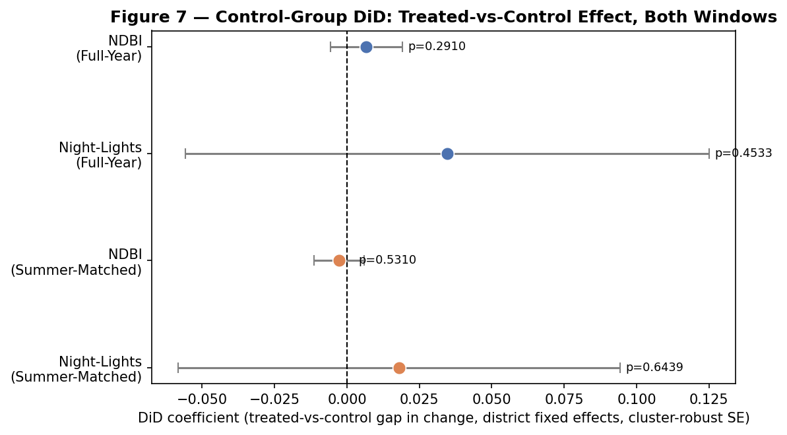
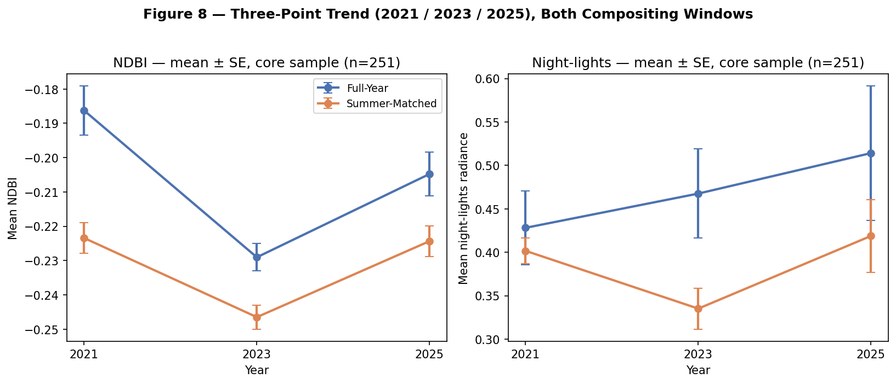
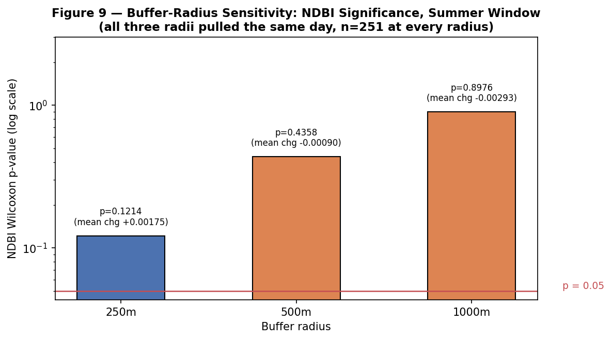

# Satellite Verification of India's Vibrant Villages Programme: A Compositing-Window Robustness Assessment of Border-Village Development

**Sakshi D. Maske**
Independent Geospatial Researcher

## Abstract

Ask the Government of India if things have worked out for them with their flagship scheme for the Border Villages, the honest answer (on parliamentary record) is No, it has never been verified anywhere. The Vibrant Villages Programme (VVP-I) has approved around ₹4,800 crore in support of 2,967 villages in five Himalayan border states/union territories including 662 villages marked ‘priority' for Phase-I of the programme since 2022–23. There is no impact assessment in any manner. This study utilizes two satellite proxies: Sentinel-2 built-up-index (NDBI) and VIIRS night-lights at 258 individually geocoded villages across three core states (Arunachal Pradesh, Sikkim, Uttarakhand), an illustrative sample of 7 villages in Himachal Pradesh, and compares them with a matched non-VVP control group of 753 villages across the same 14 districts. To determine if the answer depends on the way the set of 2021-2025 satellite data is synthesized, everything was calculated twice, with two defensible methods of compositing the same satellite record. It does. A full year composite doesn't show any significant difference in built-up area (Wilcoxon signed ranked, p = 1.000), and the same villages, but shifted to one year in the June-September window shows a difference (Wilcoxon signed ranked, p < 0.000001); the data is contaminated by snow and the summer monsoon cloud wipes out Sikkim's data. At that point, before any robustness testing is done, that is the headline. What holds up, then, is narrower than either raw number on its own. The summer-window signal holds (did coefficient = +0.0377, cluster-robust p = 0.0021), but the full-year gap does not (p = 0.215) indicating evidence for an effect specific to VVP-I villages and not the region. Sweep the extraction buffer from 500m down to 250m or out to 1km, and the result is stable for all distances at which samples were extracted (all p < 0.002). Extend the gap to 3 years (2021, 2023, 2025) and a new complication comes to light: 2021 is reported as the gap compared to 2025, but that's really a story of recovery between 2023 and 2025; you'll see it recover nicely from 2023 to 2025, and the reported gap isn't a steady growth. Night-lights, tested the same way the rest of the series were ran, do not show a meaningful trend through either the full year (p = 0.050) or just the summer months (p = 0.9999), making it the more believable of the two proxies, simply because it doesn't change with the seasons. Even the nature of the budget tells its own story, as the amount of sanction in Arunachal Pradesh is roughly ten times higher than Uttarakhand (2,749.74 cr INR vs 270.58 cr INR) but the change is almost similar (measured, +0.0284 vs +0.0293). No significant effect is produced for built-up change from border proximity (H3), though a much more unstable effect is produced for night-lights, strict to the full-year time period (ρ = 0.043–0.037, both not significant). None of this leads to a clear verdict — and that is not the verdict that VVP-I would like to report — although the one signal that does make it past every test thrown at it, and that is the beauty of the business: a control group, three years of data, and three buffer radii, that one signal clears.

The new ideas include the Vibrant Villages Programme, border development, Securitization Theory, satellite verification, NDBI and VIIRS night-lights, robustness testing, remote sensing, difference-in-differences.

---

## 1. Introduction

India's border villages have been part of the discourse of policy for long, as liabilities – they are found in remote areas, are sparsely populated, and prone to being lost out – towards a ‘contested frontier'. That's the solution the Vibrant Villages Programme (VVP-I) has proposed and taken to the Union Cabinet for approval, which cleared the project in February 2023, turning 2,967 villages in Arunachal Pradesh, Sikkim, Uttarakhand, Himachal Pradesh and Ladakh into development priorities, not security afterthoughts. One thing is missing from that story, however, more than two years after sanction gone by, there has been no independent basis of determining whether the promised development actually occurred. This time, Parliament directly asked, has VVP made an impact? The reply was unambiguous: No impact assessment has been done (Lok Sabha Unstarred Question No. 508 of 3 February 2026, Ministry of Home Affairs).

This study is just that. Test—village by village—whether any physical development appears on the ground because of sanction; whether the size of a village correlates with any of the state's budgets; whether its location is more closely related to being near the border as opposed to the level of development required. Here is the place of securitization theory: If border infrastructure is a geopolitical sign, rather than a welfare policy measure, then results should be as correctly predicted as crucially as need is.

There are five research questions that emerge from this, namely, does expansion of built-up area happen at priority villages since sanction (RQ1); does the size of this expansion correspond to the budget allowed (RQ2); do the night-lights confirm the picture of built-up area changes (RQ3); is development concentrated along the border and not where it is most needed (RQ4); and is all of this growth linked to VVP-I or is it linked at the village level generally (RQ5)? Four hypotheses provide operationalizations of the questions. Time since the implementation of the policy makes a big difference on the measure of built-up area. This increase will not grow proportionally to budget: the increase will be relatively smaller in the states with relatively bigger budget. Villages closer to the border/LAC seem to transform more rapidly than those further away within the same State, as securitization theory would suggest. The test that identifies a programme effect beyond the general trend – or difference – shows that change is significantly higher in H4 priority villages as compared to a matched set of non-H4 priority villages within the same districts and the same period.

## 2. Literature Review

### 2.1 Securitization Theory and Border Development

By shifting the agenda from "ordinary" politics to securitisation, opportunities to unlock resources and "extraordinary" measures that wouldn't be politically possible arise (Buzan, Wæver, & de Wilde, 1998). Spending on border development is an almost perfect fit into this picture: As spending on welfare, it is legitimate; as spending to build strategic links, it is also legitimate; and money is seldom separated in policy literature. Here, VVP-I is used as a test case of that theory: is geographic proximity to the border an even better indicator of measurable development than the conventional indicators of development — existing infrastructure that would be in place anywhere, for example —?

### 2.2 The Vibrant Villages Programme: Policy Context and the Accountability Gap

The Vibrant Villages Programme is firmly grounded in the policy context and the accountability gap.

However, the paper trail in VVP-I's scope lies not altogether in one place in the parliamentary replies. The complete village-wise annexure has been provided in the Rajya Sabha Hansard (Question No. 2321, Ministry of Home Affairs dated 9 August 2023). The 75 priority villages of Himachal Pradesh have been confirmed in Lok Sabha Question No. 2104 (2023) and in Rajya Sabha Question No. 401 (2025) but there is no list of the villages at the name level. Ladakh's 35 sanctioned villages are officially confirmed as such in Lok Sabha Question No. 4360 (2025), but without measures published giving the names of the villages. And answering the question that comes to everyone's mind when reading this article — Lok Sabha Unstarred Question No. 508 (3 Feb 2026) — Shri Baijayant Panda asked whether VVP's effect has been assessed and the Ministry's reply was straightforward — "No impact assessment has been done". As in searching any of the governmental sources, there are none that present an independent, satellite-verified account of actual advances made over the predetermined scope. This study comes to fill that void.

### 2.3 Remote Sensing Approaches to Built-Up Area and Economic Activity Detection

The objective of this part is to explore Remote Sensing techniques geared towards the detection of Built-up Area and Economy activity.

Here two indices take the analytical weight, selected for various reasons. A widely-used proxy for built‐up surface extent in multi‐temporal comparison is the Normalized Difference Built‐up Index derived from the reflectance in the short‐wave infrared and near‐infrared bands (Zha, Gao, & Ni, 2003). The source of radiance as measured by the VIIRS Day/Night Band is somewhat related, but quite different: the amount of electrification and economic activity, and it has excellent dynamic range and resolution compared to the older DMSP-OLS (Elvidge, Baugh, Zhizhin, Hsu, & Ghosh, 2017). This study uses two indices that work well with each other (NDBI versus vegetation phenology and snow; VIIRS versus cloud cover and sensor saturation at low radiance). If either one disagrees with the other, it doesn't necessarily mean either is wrong — but where they agree, that carries more weight than either alone.

### 2.4 Compositing-Window Sensitivity in Multi-Temporal Satellite Analysis

Change detection for spectral data is difficult for high-relief terrain in certain ways: First, snow cover and cloud frequency vary both by season and elevation; and second, a choice of compositing that isn't elevation-sensitive can create or obscure the signal of true change. This study doesn't consider that sensitivity as an averageable noise. It's being tested directly, as a characteristic of the result itself, and also, which is more important, one that may be reversed between two enthusiastically defendable compositing windows — if either of them were a sole source of confirmation, then that would be the test, wouldn't you focus it on them?

## 3. Data and Methodology

### 3.1 Study Design

Only three States, namely Arunachal Pradesh, Sikkim, and Uttarakhand involving 251 villages alone which can be identified on the basis of the village-wise information officially available, are part of the core statistical sample. The 7 confirmed villages of Himachal Pradesh are summarized separately as an exemplar village study, rather than included as part of the core sample, and Ladakh is not included in any village-level study (Section 6.1) because of a documented data-availability gap. The difference between the villages in each group before and after treatment is compared against a difference-in-differences specification (H4) of the before/after comparison that includes a district-fixed-effects difference to remove the district-specific trend that all villages in each district experience, irrespective of whether they participate in VVP or not, and a comparison to a matched non-VVP control group of 753 villages in the 14 districts to do this. Two additional checks take the translation of "2021-vs-2025" up a level: A third, independent time point (2023) follows; the extraction buffer is fixed at 500m as throughout, and is tested out again at 250m and 1km to determine if the change of the extraction buffer's magnitude changes the answer as well as the compositing window.

### 3.2 Data Sources

| Variable | Source | Temporal Coverage |
|---|---|---|
| Village identification | State VVP-I portals; Rajya Sabha/Lok Sabha Q&A annexures | 2023–2025 |
| Village coordinates | OpenStreetMap Nominatim; ISRO Bhuvan Village Geocoding API | Current |
| Non-VVP control village identification | OpenStreetMap Overpass API, district-matched to treated sample | Current |
| Built-up index (NDBI) | Sentinel-2 SR Harmonized | 2021, 2023, 2025 |
| Night-lights radiance | VIIRS DNB monthly composites | 2021, 2023, 2025 |
| Border/LAC geometry | Natural Earth 10m Admin-0 Boundary Lines | Current |
| Budget/project counts | State-wise VVP-I sanction figures (parliamentary record) | 2023 |

The village-level datasets first had to be compiled and geocoded.

### 3.3 Village-Level Dataset Compilation and Geocoding

Although the primary geocoding was done via Nominatim, Bhuvan was used as a Census-linked fallback — found necessary because Bhuvan doesn't filter by state (a test query for the Arunachal Pradesh village 'Kharman' initially returned an unrelated same-named village in Haryana), so manual district validation was applied throughout. All the results, both from sources, were manually validated in the districts before accepting and any village list was cross validated with the official aggregate figures first. Of the 559 villages attempted across the four states, 258 were successfully geocoded — 186 of 455 in Arunachal Pradesh, 31 of 46 in Sikkim, 34 of 51 in Uttarakhand, and 7 of 7 in Himachal Pradesh.

### 3.4 Satellite Change Detection

A buffer of 500m around each geocoded village was applied to collect mean NDBI and VIIRS night-lights radiance by using Google Earth Engine 2021 compared to 2025. The NDBI is derived from Sentinel-2 Level-2A Surface Reflectance bands B11 (SWIR1) and B8 (NIR), where cloud was masked using the QA60 band. Night-lights were derived from VIIRS Day/Night Band (NOAA/VIIRS/DNB/MONTHLY_V1/VCMSLCFG).

### 3.5 Compositing-Window Robustness Testing

Both of these measures were calculated twice – without and with the subtraction of an annual season matched measure (full composite, season matched), designed specifically to remove real change from seasonal artifact (snow in full composite, monsoon cloud in season matched composite). If there was no valid composite in a window, this village did not get zeroed out, it would be marked null.

### 3.6 Border-Proximity Analysis

The distance calculations were done in GeoPandas and the distance to only those segments of Natural Earth Admin-0 on Indian territory that are relevant to the village was computed. However, there is one proviso that applies to all the numbers that follow this: The line of actual control (LAC) between India and China here is contested, and there is no hard determinate agreed border line. Thus, all of the distances discussed in this study are only relative and comparative and in no way an authoritative delineation of the location of the border.

### 3.7 Non-VVP Control Group and Difference-in-Differences Design

A treated-only comparison can't rule out a clear alternative explanation: even in the absence of any real VVP-I effect, the same shift could have been caused by conditions shared by all these villages, irrespective of any treatment — anything from unrelated infrastructure spending, unrelated state initiatives or chance regrowth after a low year would do the same. These villages have been dynamically assembled from the same 14 districts as the sample villages using the OpenStreetMap Overpass API, excluding any village that is on a VVP-I priority list, and then processed through the same set of nodes, 500m buffer, NDBI/VIIRS definitions and before/after windows. Results were reshape to be a panel of two periods with a treatment indicator and then tested as

ndbi (or lights) ~ treatment + post + treatment×post + district fixed effects

Using the same district level variable (14 clusters), standard errors were clustered. But the coefficient of interest is that of the treatment × post, which is the difference between the treated group's change and the control group's change in the same time frame, net of the district fixed effects component of any baseline growth trend that varies across districts. A parallel HC3 heteroskedasticity-robust specification without fixed effects is reported together with that as 14 clusters is below the 30–40+ recommended for cluster-robust asymptotics to be fully trustworthy. A fully parallel-pre-trends placebo (the sort of design the project's own earlier control-group research have run elsewhere using a multi-period pre-treatment panel) can not be run on this design. Here the satellite extraction in the control group only includes the same before/after pair that the treated sample has, thereby the level-balance check (Mann-Whitney U) is a weaker at best substitute for a baseline check (2021).

### 3.8 Multi-Year Trend Extraction

Two single years, 2021 and 2025, are clearly an open possibility how to construct or destroy an apparent change that actually has nothing to do with real development, but can be triggered by weather variation. A third time point was selected, namely 2023, about halfway between the two, extracted for the same 251-village core sample under both compositing windows, and yields one value per village, annually, not another single 'before' and 'after' delta. A per-village linear trend was originally fitted over the three years and the signed ranks Wilcoxon test was used to test the slope against zero, as is often done with this kind of time series model. An additional and alternative analysis was a village-fixed-effects panel regression (value ~ year, clustered SE by village) applied to the slopes of the linear trend model. The two year spans 2021-2023 and 2023-2025 were also tested independently to generate a maximum concentration with a change in one half of the window.

### 3.9 Buffer-Radius Robustness Testing

In the other tests in this study, the 500m buffer was used as a fixed methodological choice throughout, not tested against other buffers until now. The same extraction for the summer window was repeated at 250m and 1km for the same core sample, and a Wilcoxon signed-rank test was performed on each radius. A complication arose because the 250m and 1km extractions were run at a later date than the original 500m extraction — against the identical fixed 2021/2025 date ranges, but a Sentinel-2 archive that keeps backfilling scenes close to the present — so a raw village-count comparison across the three buffer radii is confounded by that archive-timing difference rather than isolating buffer radius alone. It will come down to making sure that the three radii are restricted to the subset of villages that have data for all three, fixing sample composition and leaving only buffer radius as it varies.

### 3.10 Statistical Testing

Prior to/after change, Wilcoxon signed-rank test of difference (Wilcoxon, 1945) – paired, non-parametric, appropriate because the sample was not normally distributed. Due to their robustness to non-linear monotonic relationships, Spearman's rank correlation (Spearman, 1904) was used for budget correlation (RQ2, descriptive only – only two States had sufficient valid data) and border-proximity correlation (H3). Control-group comparison (H4) specified with Difference-in-Differences OLS from Section 3.7 with cluster-robust / heteroskedasticity-robust standard errors in parentheses.

## 4. Results

### 4.1 Village Coverage and Sample Composition

Overall 258 of 559 villages were successfully located using the geocoding pipeline. Arunachal Pradesh was home to very few civilian entries, and the fact that nothing can possibly be verified without any concrete lists of inhabited points on the border except for those administered by the BRTF camps, army staging huts, and labour camps indicates that they aren't in any civilian geospatial database anyway. This is not really a gap, more of a direct representation of what "village-level development" looks like on a securitized border.

### 4.2 Built-Up Area Change: A Compositing-Window-Sensitive Result

**Figure 1.** Distribution of NDBI change across all geocoded villages, full-year and summer-matched composites.

Two compositing windows means two different datasets means two opposite conclusions. Full-year: no significant change in the 251-village core sample (Wilcoxon signed-rank, p = 1.000), trending slightly negative at the median. Seasonal dropout: n = 154 during summer matched (June –September) highly significant increase (p < 0.000001). The reason for the reversal is not a big secret — the full-year composites of 2021 and 2025 converge on the upper boundary of the snow cover contamination band and diverge on the lower end. The summer window, however, comes with a price tag – all 31 geocoded villages in Sikkim returned zero cloud-free imagery in at least one period of this window. The timing of the months in Sikkim is a little confusing because they are in the peak monsoon season during the months when they should be without snow, etc. — one after the other.

**Figure 2.** State-wise mean built-up-area change (summer-matched composite), by state.

### 4.3 Night-Lights Change: A Stable Null

**Figure 3.** Distribution of VIIRS night-lights change (summer-matched composite).

Night-lights were maintained at the same level in the absence of NDBI: no significant change in this window (full-year p = 0.050 — borderline; summer-matched p = 0.9999 — a clean null). But like many things, it isn't affected by the phenology of vegetation and snow, and that consistency is why it has been viewed as the more reliable of the two proxies — as opposed to a vegetation/snow built-up index that is only as accurate as its component parts.

**Figure 4.** State-wise mean night-lights change (summer-matched composite), by state.

### 4.4 Budget Independence (RQ2)

**Figure 5.** State-level mean built-up-area change plotted against sanctioned VVP-I budget.

Arunachal Pradesh (demonstrating a mean change in the NDBI of +0.0284, and sanctioning revenues of ₹2,749.74 crore across 2,082 projects) and Uttarakhand (demonstrating a mean change in the NDBI of +0.0293, and sanctioning revenues of ₹270.58 crore across 200 projects) were used for comparison as they had sufficient valid summer-window NDBI coverage. A ratio of tenfold purchases resulted in about the same measured result. These two data points aren't big enough to run a formal statistical test on, but the pattern is what H2 predicted–that budget scaling is a bit less linear for a physical-development signal.

### 4.5 Border-Proximity Testing (H3)

**Figure 6.** Distance-to-border versus NDBI change and night-lights change, both compositing windows.

The extent of built-up change was not correlated with distance to the border/LAC within the sample in either window - full-year ρ = 0.043 (p = 0.497) and summer-matched ρ = 0.037 (p = 0.650), which remained a null in each case regardless of which window was selected. The results for night-lights were more complex—a strong relationship in the full-year window towards more change in the closer villages (ρ = -0.259, p < 0.0001, H3 prediction) with no such relationship in the summer matched window (ρ = -0.076, p = 0.233). As described in Section 4.2, this window-sensitivity has been noted by some, but is not confirmed by any.

### 4.6 Control-Group Difference-in-Differences: Isolating a VVP-I-Attributable Effect (H4)

**Figure 8.** District-fixed-effects DiD coefficient (treated-vs-control gap in change) with 95% confidence intervals, NDBI and night-lights, both compositing windows.

Against the matched 753-village control group, the summer-window NDBI gap holds up: did coefficient = +0.0377, 95% CI [+0.0137, +0.0617], cluster-robust p = 0.0021 (HC3 no-fixed-effects comparison: +0.0287, p = 0.0116). The situation in treated villages in summer is more extreme than that which was found elsewhere in the area, again even after allowing for this noise factor. As before in Section 4.2, the full-year gap is not significant (+0.0082, p = 0.2153) — this is the design which also accounts for the regional trend. No DiD effect was observed in the night-lights in either window (full year p = 0.7229), and summer (p = 0.8485). There is a caveat, however, underlying all this: treatment and control villages show significant differences at baseline (equal to 2021) for both windows, with the mean NDBI for treated villages being much lower than the mean NDBI for control villages (summer: treated mean of −0.246 vs. control mean of −0.185; Mann-Whitney p < 0.00001). This comparison was not surprising — as noted above, VVP-I priority villages were chosen in part because they were in some way more remote and more close to security — but the baseline difference rests on a level difference rather than a directly confirmed shared pre-trend, since a genuine multi-period pre-treatment panel wasn't extracted for the control group (see Section 3.7). As it happens, the direction overall is pretty much uniform: treated minus control positive in 8 of 10 districts with reasonably high summer-window NDBI coverage, and not due to any one district or two.

### 4.7 Multi-Year Trend: A Non-Monotonic Recovery Pattern

**Figure 9.** Mean NDBI and night-lights radiance at 2021, 2023, and 2025, core sample, both compositing windows, error bars ± 1 SE.

The "2021-vs-2025 story" becomes more complex when a third year of observations is added. In the summer-matched window, mean NDBI actually declines from 2021 to 2023 (mean change = -0.0231, Wilcoxon p = 1.000 — not a significant increase, a decline), then rises sharply from 2023 to 2025 (mean change = +0.0222, p < 0.000001). However, the overall 3-year linear trend is not significant (mean per-village slope = -0.0002/year; Wilcoxon p = 0.442; village fixed-effects panel regression p = 0.728). The full-year window shows the identical shape (decline then a significant increase in 2023-2025: p = 0.000001), but the two statistical specifications disagree as to the overall trend of this window: Wilcoxon p = 1.000, panel regression p = 0.000001, a discrepancy which stems from the fact that the latter gives more weight to the recovery in 2023-2025 than the previous decline did, which is not done by Wilcoxon. Crucially, the key 2021-vs-2025 result that we always cite at the beginning of Section 4.2 should be read as a 2023-to-2025 recovery in a two-point comparison, and the earlier downturn should not be forgotten when reading the headline number.

### 4.8 Buffer-Radius Sensitivity: A Stable Result Once Sample Composition Is Matched

NDBI Wilcoxon p-value (log scale) at 250m, 500m and 1km buffer radii (grey, varying n) as compared to the matched subsample found at all 3 radii (green, fixed n=154) for the summer window — as extracted.

Taken at face value, the significant 500m result (n=154, p < 0.000001) doesn't survive a switch to 250m (n=251, p = 0.126) or 1km (n=251, p = 0.899). But taken at face value is doing a lot of work here, because the 250m and 1km extractions were delayed, and only availability of complete data was achieved for 97 core-sample villages (66 in Arunachal Pradesh, 31 in Sikkim), not really due to a buffer-radius phenomenon (Section 3.9), but rather because of a Sentinel-archive backfill. The disagreement and the confound disappear once limited to the 154-village subsample with valid data of all three (250m, p = 0.000009; 500m, p < 0.000001; 1km, p = 0.001471), since the results are significant and directionally consistent at all three. 500m was used as the buffer throughout this study, so this shows the finding isn't just an artifact of that specific choice.

### 4.9 Robustness Summary

Significance for all four core tests with both compositing windows (p-value, log scale) with reference line at p = 0.05. Conclusions of a test differ if the test entries are in different windows, but two points of the test lie on opposite sides of the line.

Line up each of the four core tests against both windows and two different patterns show up. H1 (built-up change) and the H3 night-lights correlation both cross the p = 0.05 line between windows — full-year non-significant, summer-matched significant for H1, and the reverse for H3 night-lights. By definition this is affected by the compositing window. The H3 NDBI-proximity test, by contrast, stays a non-significant test in both windows (p=0.497 full-year; p=0.650 summer-matched) — a truly stable null, not merely a test that happened not to flip. The distinction is important because each is reported differently: unstable results remain a subject of conjecture either way, while a null result that holds regardless of window gains more confidence precisely because there was no window dependency. Overlap the three checks from Sections 4.6-4.8 on top, and another picture emerges specifically for the summer-matched NDBI result: it passes a test against a matched control group, a buffer-radius sweep once sample composition is fixed, and, additionally, it appears to be located in the second half of the study window rather than the first. What it really means is narrowed, not resolved, by three independent stress tests — none of which just cries, "Yes, it's so."

The eight headline p-values presented across this section (4 tests x 2 windows) are not corrected for multiple testing here given that they are used to address different research questions. Just for a sake of caution, let's apply a paper-wise Holm-Bonferroni correction (family-wise α = 0.05); both of the results that are significant in the paper turn out to be significant after the correction (the former with alpha adjusted to 9.3 × 10⁻¹⁵, the latter 3.2 × 10⁻⁵), and all the results remaining non-significant do not change. That validates the two key findings aren't a coincidence that they were both being run concurrently. The sections following this correction (4.6–4.8 robustness tests) were designed after this correction had been applied, not as further tests on the same set of multiple tests.

## 5. Discussion

Clearly the main finding here is not that there happened to be a rise or fall in physical development, but that there happened to be an instability in the one metric that produced a "significant" result at all — and, where that instability could be stress-tested against a control group, a multi-year trend, or a buffer-radius sweep, a more precise picture of what the surviving signal actually represents. But a single date, single window spectral comparison is not alone enough to make an unequivocal conclusion on built up change: both shifts of snow and monsoonal clouds have the ability to reverse the sign of a result, especially in high relief environments in the Himalayas. Night-lights, the more temporally stable of the two proxies, shows no confirmed rise under either window. Finally, where expenditure and change were compared directly there was no tenfold measured difference between a tenfold difference in investment.

Nevertheless, the summer-matched NDBI gain is not insignificant. All three stress tests for significance in this study have not yet altered it; it is the only result that succeeds each of three—but not one—stress tests: to see it beat the change in districts that did not match VVP-I, but were included in the control group, to see it not be an artifact of a specific 500m buffer selected elsewhere in the study, to see that Holm-Bonferroni correction for multiple testing does not affect it. What it does not do is confirm, of course, steady growth as predicted by VVP-I. The three-point trend extension (Section 4.7) reveals that the change over time in 2021-2025 is focused in one of the later years (2023-2025) and is indicative of a late-window acceleration that is more successful than a sustained development from sanction, but which cannot be tied definitively to whether the earlier years in 2021-2023 were a direct result of weather, or if the change is just at the end of one of the three-year windows. The comparison to the control group bolsters the argument that the remaining signal is not from the area per se, but is likely from VVP-I priority villages that differ aggregate measures from the rest of the region as a result of having been deliberately selected for analysis; however, the results of the comparison baseline check done within the control group suggest a measurable difference in NDBI’s at the beginning of the comparison year (2021), which gives indication that the DiD estimate is less of a natural and complete experiment than it suggests, but is less of a reason to disregard it as a genuine measurement of the effect.

Add to all of that a stable null result (border-proximity) and an unstable, window-sensitive result (night-lights), and you don't get grounds to confidently claim that VVP-I's investment has led to development at the rate or scale that the budget would suggest, or that development has been prioritized on the basis of increased border-proximity rather than developmental need. Much narrower than the raw two-window comparison, though, is what the evidence actually supports: that built-up area, once checked against a control group and a buffer-radius sweep, really is larger in priority villages than it was before the programme — but concentrated in the more recent half of the study period rather than sustained since sanction — and the programme itself has still never been the subject of an official impact assessment to account for this. The programme's own parliamentary record admits this very gap in accountability. A scheme of this scale, framed at once as welfare and as strategic signal, has never been independently evaluated; the layers of nuance this study's robustness checks add — rather than remove — are exactly why that gap matters, not a convenient way to avoid a verdict either way.

## 6. Limitations

### 6.1 Village Coverage Gaps

Ladakh's 35 sanctioned villages are fully excluded from village-level analysis, since no publicly indexed source reports their names — closing this gap would require an RTI request not pursued within this study's scope. Himachal Pradesh is included in a small sample of illustrative cases – with only 7 of 51 inhabited priority villages designated – and not included in the main statistical sample. The names of 19 villages in Uttarakhand's block of Pithoragarh have been confirmed with no block assigned.

### 6.2 Border Geometry as Cartographic Approximation

The geometry is approximated by the Polygon boundary.

All distance to the border figures in this study are based on the cartographic boundary line used in Natural Earth which is a simplified version of a Line of Actual Control whose alignment is not agreed upon at an international level. These numbers take the place of authoritative numbers and should be read as a comparison instead.

### 6.3 Budget-Correlation Scope and Ecological Inference (RQ2)

This is an example of budget-correlation scope and ecological inference (RQ2).

RQ2: In only 2 states, valid data was provided, that is why it is represented descriptively and not confirmatively. Now, there is also a gap in thinking: the comparison is of a state level sanctioned budget and the sampled mean at the Village level; and the budget figure describes the spending of the state's entire VVP-I portfolio — not the Village this study happened to geocode. Don't use a like for like test, use suggestive.

### 6.4 Compositing-Window Sensitivity

These built-up-area and border-proximity findings are most centrally compositing-window-sensitive as opposed to stable. That instability — not picked up by being willing to settle for either of those "clean" results — is described as a restriction on single-date spectral comparison, for this terrain.

### 6.5 Geocoding Coverage and Selection Bias

A mere 258 out of 559 (or 46%) villages were geocoded with a disproportionate number of villages falling out of bounds in Arunachal Pradesh after a drop of 269 of the 455 villages therein (Section 4.1). A village not geocoded with OSM/Bhuvan may reasonably be expected to have a smaller population size, to be further away and/or less well known by administrative records, and hence be more likely to have a higher proportion of residents working in the area with low accessibility. It is prudent not to assume this, however; a Mann-Whitney U test was conducted for Arunachal Pradesh, the population and the household counts of which were available for every village in the raw list regardless of the outcome of geocoding, and there was no significant difference between geocoded and non-geocoded villages in round population (matched mean 135.0 vs. unmatched 145.7, p = 0.310) or round households (matched mean 25.8 vs. unmatched 28.8, p = 0.540). The possibility that a selection bias based on village size might have heavily influenced these successful results seems not to be ruled out here, but at least not made obvious by the relationship to size. The raw village list in both Sikkim and Uttarakhand did not contain the population or household field information, thus it was not possible to perform this check for both these locations.

### 6.6 No Ground-Truth Validation

This is a study with only a satellite module. There is no known "positive control" (one that has been confirmed by, say, an official press-release about the project that has been published at an appropriate time) of a finished VVP-I project, at 500m resolution, to be used as a sort of positive test for the sensitivity of NDBI and VIIRS to what VVP-I funds: a village road and a school building, and a scattering of houses. During this study's review, one particular positive control sample for this study did not meet the requirement of providing the specific, dated, named positive control set, and this check could not, therefore, be performed with actual data. Carried forward as a tangible aspect to Future Work, not silently dismissed.

### 6.7 Baseline Imbalance in the Control-Group Comparison

The H4 comparison in Section 4.6 revealed that the extracted mean NDBI value for treated and control villages in 2021 are significantly different from each other, and the parallel comparison could not be conducted by performing a placebo test (no pre-treatment village). In this approach district fixed effects control for district-level differences in terms of district-level baseline selection into the treated group and do not adjust the selection of the group at the village level. Interpret the DiD estimate as provided by a control-group adjusted natural experiment, not as a fully clean natural experiment.

### 6.8 Non-Monotonic Multi-Year Pattern

The reported 2021-vs-2025 summer NDBI expansion was figured in just one portion of the three-point extension in section 4.7, instead of being a sustained gain over the whole window, but a recovery from a previous 2021-vs-2023 NDBI loss was observed. This should be interpreted in conjunction with Section 4.7 (not as a ‘steady trend’ given that it is a comparison to 2025 made in a period when the rollout was not yet complete), but this is only an approximation looking ahead beyond 2021.

### 6.9 Archive-Timing Confound in the Buffer-Radius Comparison

This is also the buffer/radius comparison procedure confound.

In Section 4.8, the 250m and 1km buffer extractions ran on a later date than the original 500m extraction, and because of this — and the Sentinel-2 archive-backfill effect — complete data was available for 97 core-sample villages that were null at 500m (but were not null at 250m and 1km), which was diagnosed as a Sentinel-2 archive data back-fill effect and not as an error about buffer size. It is corrected by the matched-subsample comparison in that section, but the inherent asymmetry will not make the three buffer extractions exact replicas of the same archive state. Technically, for a complete "clean" re-run, all three radii would need to be reextracted on the same day.

## 7. Future Work

The items listed below represent specific extensions that emerged via the review process for this study, and which are not currently being done, but rather are intentionally presented separate from the Discussion and Limitations so as the actual activity does not become confused with the possibilities that remain.

### 7.1 SAR-Based Change Detection

The first advantage of Sentinel-1 SAR (VV/VH backscatter or coherence change) is that it avoids the cloud cover and avoids the optical snow-contamination confound that was the reason for this study's compositing-window check in the first place. It would not, on its own, "resolve the dispute" regarding the "full-year" vs "summer-match" optical effects — it would provide an actual, independent third measurement that would be unaffected by the known artefacts and which could help determine which optical effect is a more "reliable" measure.

### 7.2 Building-Footprint or Sub-500m Structural Analysis

The 500m NDBI buffer has merged built-up surface, bare rock area, agricultural surface, and natural vegetation together in one slick number – a coarse metric of what VVP-I does invest at the village level: investments are created for individual roads, buildings, small installations. An area-averaged index could be replaced by detection at the structure level with high-resolution optical imagery (PlanetScope); or open building-footprint datasets (Google/Microsoft).

### 7.3 Ground-Truth Positive-Control Validation

None of the known, dated and independently verified completed VVP-I initiatives that are also in the 258 village-level geocoding sample (Section 6.6) were identified. The historical data that was used in coming up with this study assumption would be directly tested by identifying one, two or three such villages taking from a press release or news report of a specific completed road or building, and determining if the individual village's NDBI/VIIRS signal, taken at that site, is detectable.

### 7.4 RTI Follow-Through for Himachal Pradesh and Ladakh

In fact, in this study, the purposeful decision was made not to press RTI requests for these two states' missing village-wise annexures, which are recorded in the BO_Development_Log.md. That must be reversible — requesting those would fill in the two biggest known gaps in primary-source information coverage instead of the illustrative or excluded treatment as documented here.

### 7.5 A Genuine Pre-Treatment Panel for the Control Group

A true multi-period pre-treatment panel doesn't exist, because the control-group comparison (Sections 3.7, 4.6, 6.7) is not a multi-period pre-treatment panel; a multi-year extension of this study would allow conducting a true multi-period pre-treatment panel comparison for the treated sample, allowing for a proper parallel pre-treatment trends placebo test. The gap would be closed directly, if 2019 and 2020 values were available for the same villages for the 753 control villages, and ideally, the same pre-2021 values for the treated sample as well.

## 8. Conclusion

This study can't clearly and confidently conclude that the pace of development a budget of this size would imply, let alone the steady annual progress trajectory the scheme aims toward, has been achieved at the priority villages within India's Vibrant Villages Programme in five border states and union territories. It is not that there's nothing to discover, rather that the one indicator that does see a large increase does in just one of two otherwise good measurement windows, and the other, more temporally stable indicator available shows no increase under either. That one finding is further supported by three independent methods in three more stress tests: a district-fixed-effects comparison to 753 district-matched non-VVP villages in the same districts; a buffer-radius sweep to confirm it isn't a random characteristic of the 500m radius boundary; and a three-point sweep in 2021/2023/2025 to reveal the change is focused on a recovery period between 2023 and 2025, not sustained growth since sanctions. When budget and measured change were comparable, there was no comparable change in outcome when budget changes by a factor of ten. The implication is right on the nose. Given the scale and strategic framing of this scheme, it should not continue without the independent impact assessment that its own parliamentary record confirms has never been conducted — and any future assessment should be held to the same standard applied here: a compositing window, a control group, and a multi-year comparison, rather than whichever single-window, single-year, uncontrolled result happens to be most convenient to report.

## References

Buzan, B., Wæver, O., & de Wilde, J. (1998). *Security: A New Framework for Analysis*. Lynne Rienner Publishers. [https://www.rienner.com/title/Security_A_New_Framework_for_Analysis](https://www.rienner.com/title/Security_A_New_Framework_for_Analysis)

Zha, Y., Gao, J., & Ni, S. (2003). Use of normalized difference built-up index in automatically mapping urban areas from TM imagery. *International Journal of Remote Sensing*, 24(3), 583–594. [https://doi.org/10.1080/01431160304987](https://doi.org/10.1080/01431160304987)

Elvidge, C. D., Baugh, K., Zhizhin, M., Hsu, F. C., & Ghosh, T. (2017). VIIRS night-time lights. *International Journal of Remote Sensing*, 38(21), 5860–5879. [https://doi.org/10.1080/01431161.2017.1342050](https://doi.org/10.1080/01431161.2017.1342050)

Wilcoxon, F. (1945). Individual comparisons by ranking methods. *Biometrics Bulletin*, 1(6), 80–83. [https://doi.org/10.2307/3001968](https://doi.org/10.2307/3001968)

Spearman, C. (1904). The proof and measurement of association between two things. *American Journal of Psychology*, 15(1), 72–101. [https://doi.org/10.2307/1412159](https://doi.org/10.2307/1412159)

Angrist, J. D., & Pischke, J.-S. (2009). *Mostly Harmless Econometrics: An Empiricist's Companion*. Princeton University Press. [Difference-in-Differences specification, Section 3.7] [https://press.princeton.edu/books/paperback/9780691120355/mostly-harmless-econometrics](https://press.princeton.edu/books/paperback/9780691120355/mostly-harmless-econometrics)

Ministry of Home Affairs. (2023, August 9). *Rajya Sabha Unstarred Question No. 2321: Vibrant Villages Programme*. [https://www.mha.gov.in/MHA1/Par2017/pdfs/par2023-pdfs/RS09082023/2321.pdf](https://www.mha.gov.in/MHA1/Par2017/pdfs/par2023-pdfs/RS09082023/2321.pdf)

Ministry of Home Affairs. (2023). *Lok Sabha Question No. 2104: Vibrant Villages Programme*. [https://sansad.in/ls/questions/questions-and-answers](https://sansad.in/ls/questions/questions-and-answers)

Ministry of Home Affairs. (2025). *Rajya Sabha Question No. 401: Vibrant Villages Programme*. [https://sansad.in/rs/questions/questions-and-answers](https://sansad.in/rs/questions/questions-and-answers)

Ministry of Home Affairs. (2025). *Lok Sabha Question No. 4360: Vibrant Villages Programme*. [https://sansad.in/ls/questions/questions-and-answers](https://sansad.in/ls/questions/questions-and-answers)

Ministry of Home Affairs. (2026, February 3). *Lok Sabha Unstarred Question No. 508: Vibrant Villages Programme*. Reply by Shri Nityanand Rai, Minister of State, to a question by Shri Baijayant Panda. [https://www.mha.gov.in/MHA1/Par2017/pdfs/par2026-pdfs/LS03022026/508.pdf](https://www.mha.gov.in/MHA1/Par2017/pdfs/par2026-pdfs/LS03022026/508.pdf)

Natural Earth. (2024). *1:10m Cultural Vectors — Admin 0 Boundary Lines*. [https://www.naturalearthdata.com/downloads/10m-cultural-vectors/10m-admin-0-boundary-lines/](https://www.naturalearthdata.com/downloads/10m-cultural-vectors/10m-admin-0-boundary-lines/)

OpenStreetMap contributors. (2024). *Overpass API*. [https://overpass-api.de/](https://overpass-api.de/) [Non-VVP control-group village identification, Section 3.7]
