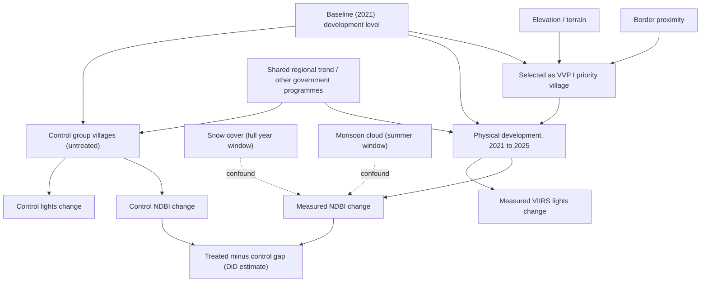
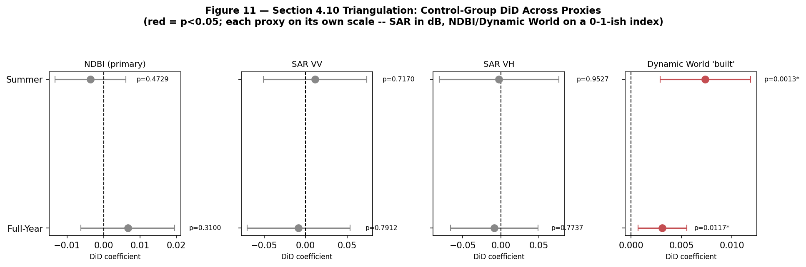
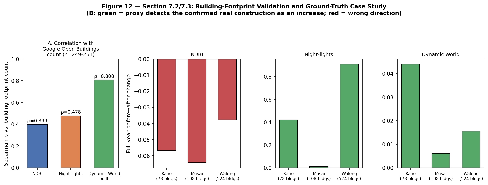

# Satellite Verification of India's Vibrant Villages Programme: A Compositing Window Robustness Assessment of Border Village Development

**Sakshi D. Maske**
Independent Geospatial Researcher

## Abstract

Ask the Government of India if things have worked out for them with their flagship scheme for the Border Villages, the honest answer (on parliamentary record) is No, it has never been verified anywhere. The Vibrant Villages Programme (VVP I) has approved around ₹4,800 crore in support of 2,967 villages in five Himalayan border states/union territories including 662 villages marked 'priority' for Phase I of the programme since 2022 to 23. There is no impact assessment in any manner. This study utilizes two satellite proxies: Sentinel 2 built up index (NDBI) and VIIRS night lights at 251 individually geocoded villages across three core states (Arunachal Pradesh, Sikkim, Uttarakhand), plus an illustrative sample of 7 villages in Himachal Pradesh (258 villages in total across all four states), and compares them with a district restricted non VVP control group of 721 villages across the same 14 districts (deduplicated against the treated sample by coordinate proximity and by the full official priority village name list, not just by exact name match against successfully geocoded villages, see Section 3.7; district membership independently verified against real administrative boundaries for all but one district, see Section 6.5/Development Log Entry 37). Everything was calculated twice, with two defensible methods of compositing the same 2021 to 2025 satellite record, specifically to check whether the answer depends on that choice. On the headline test, it mostly doesn't, once both windows are extracted completely and on the same day as the control group: neither shows a significant treated only built up area increase (full year Wilcoxon p = 1.000; summer matched, June September, p = 0.435831, n = 251). That second number is the one that changed. An earlier version of this same summer window test, run before all 31 Sikkim villages' monsoon season imagery had backfilled into the Sentinel 2 archive, returned p < 0.000001 on a 154 village subsample missing Sikkim entirely, a result that looked like a clean, surviving signal until the complete sample was ready (see Development Log Entries 21 to 22 for the full account, including two extraction script bugs found and fixed in the process of getting there). Against the control group, the story is the same: neither window's NDBI gap holds (full year did coefficient = +0.0067, p = 0.291; summer = -0.0028, p = 0.531, now on the complete 251 treated/721 control sample, district-verified against real administrative boundaries for all but one district), nor does the buffer radius sweep (250m/500m/1km, all now pulled the same day, all null: p = 0.1214/0.4358/0.8976), nor the leave one district out check (0 of 14 reruns significant, against 14 of 14 on the earlier, incomplete sample), nor a randomization inference test that doesn't depend on cluster asymptotics (p = 0.229). Night lights tells the same story when just looking at treated villages, with no absolute change in either window (Wilcoxon p = 0.050 full year, p = 0.9999 summer), and, as of a fix to the control group list that removed 23 villages that were physically or nominally duplicates of treated villages (Development Log Entries 23 to 25), also against the control group in both windows: a full year gap that had briefly looked like this study's one surviving significant result is null on the corrected, contamination free control list (p = 0.453), and fails the same leave one district out and randomization inference checks that had previously been cited as evidence it was holding up. This primary null has since been tested two further ways it had not yet faced: an exact wild cluster bootstrap (16,384 sign flip combinations, addressing this study's reliance on only 14 district clusters) leaves all four outcome/window DiD results non significant (p = 0.35 to 0.68), and an actual 2019 to 2021 parallel pre trends placebo test, something the original single pre period control design could not support, is clean in three of its four combinations, with the fourth (summer NDBI, p = 0.074) borderline and reported as such. One further correction (Development Log Entry 37): a district-verification rerun closed the control list's remaining data-quality gap for two of the three affected districts, taking the list from 732 to 721 villages, and every number above reflects that corrected list, including the placebo test itself, re-extracted against it at Development Log Entry 41 with no change in conclusion — none change conclusion, except the full-year night lights baseline balance check, which is newly imbalanced where it previously was not (Section 6.7).

Built up change also correlates with distance to the border/LAC (H3), in the opposite direction from what securitization theory predicts, summer NDBI (ρ = 0.291, p = 0.0000026) and full year lights (ρ = -0.252, p = 0.0000548). Once described as a fresh, unstress tested finding, this correlation has since been run through leave one district out (14 of 14 reruns significant, same sign), randomization inference (p < 0.001), and a spatial autocorrelation calibrated permutation test that treats the 251 villages as the non independent observations they are, and survives all three (spatially corrected p = 0.0295 summer NDBI, p = 0.0035 full year lights). This makes it a solid secondary finding now. It used to be just an open question.

One further check did not simply confirm the primary null. It is reported here as an open, unresolved tension, and it has not been smoothed over. Triangulating NDBI/lights against two satellite proxies found Sentinel 1 SAR backscatter (the only one that is truly sensor independent) agreeing (null, both windows, both polarizations), but Dynamic World's machine learned built up probability disagreeing: a significant control group DiD in both windows (p = 0.0159 full year, p = 0.0006 summer) that is hard to dismiss, since Dynamic World also validates far more strongly against an independent, non satellite ground truth (Google Open Buildings footprint counts, ρ = 0.808 vs. NDBI's ρ = 0.399) and correctly detected all three of this study's confirmed construction case studies (Kaho, Walong, Musai) where NDBI moved in the wrong direction at all three. A second check that initially looked like a second open tension, cross checking the QA60 cloud mask against an SCL band alternative, which first appeared to flip the summer NDBI result from null to significant, turned out on external review to be a coding bug (the SCL mask was letting snow pixels through as "clear"). Fixed and rerun on the corrected 251 village sample, the two masks agree, both null (p = 0.436 QA60, p = 0.288 SCL). That is reported as a resolved bug caught by review, not as a second surviving tension.

Budget still doesn't track outcome in a way worth building a claim on: with all three core states now having valid summer data, Arunachal Pradesh's roughly tenfold larger sanctioned budget over Uttarakhand's corresponds to a smaller mean NDBI change, and Sikkim's smallest budget of the three corresponds to a negative one, descriptive only, n = 3, and the correlation's sign flips between the two compositing windows. None of this is the verdict this study originally reported, and that reversal is itself part of the finding: on its primary measure, once the extraction is complete, treated/control data pulled the same day, and the design stress tested against small cluster bias and a true pre treatment placebo, no satellite detectable effect of VVP I survives, a plain, reportable answer to a question Parliament's record says was never asked. Triangulating against an independently ground truth validated proxy surfaced a sensitivity in that primary measurement. This paper reports that sensitivity here instead of explaining it away, alongside a border proximity pattern that, unlike it, has now been fully stress tested and holds. A second apparent sensitivity, in the cloud masking convention, turned out under review to be just a coding bug, nothing more.

**Keywords**: Vibrant Villages Programme, border development, securitization theory, satellite verification, NDBI, VIIRS night lights, SAR backscatter, Dynamic World, building footprint validation, remote sensing, robustness testing, wild cluster bootstrap, spatial autocorrelation, cloud masking sensitivity, difference in differences.

---

## 1. Introduction

India's border villages have been part of the discourse of policy for long, as liabilities, they are found in remote areas, are sparsely populated, and prone to being lost out, towards a ‘contested frontier'. That's the solution the Vibrant Villages Programme (VVP I) has proposed and taken to the Union Cabinet for approval, which cleared the project in February 2023, turning 2,967 villages in Arunachal Pradesh, Sikkim, Uttarakhand, Himachal Pradesh and Ladakh into development priorities, not security afterthoughts. One thing is missing from that story, however, more than two years after sanction gone by, there has been no independent basis of determining whether the promised development happened. This time, Parliament directly asked, has VVP made an impact? The reply was unambiguous: No impact assessment has been done (Lok Sabha Unstarred Question No. 508 of 3 February 2026, Ministry of Home Affairs).

This study is just that. Test, village by village, whether any physical development appears on the ground because of sanction; whether the size of a village correlates with any of the state's budgets; whether its location is more closely related to being near the border as opposed to the level of development required. Here is the place of securitization theory: If border infrastructure is a geopolitical sign and not a welfare policy measure, then results should be as correctly predicted as crucially as need is.

There are five research questions that emerge from this, namely, does expansion of built up area happen at priority villages since sanction (RQ1); does the size of this expansion correspond to the budget allowed (RQ2); do the night lights confirm the picture of built up area changes (RQ3); is development concentrated along the border and not where it is most needed (RQ4); and is all of this growth linked to VVP I or is it linked at the village level generally (RQ5)? Four hypotheses provide operationalizations of the questions. Time since the implementation of the policy makes a big difference on the measure of built up area. This increase will not grow proportionally to budget: the increase will be relatively smaller in the states with relatively bigger budget. Villages closer to the border/LAC seem to transform more rapidly than those further away within the same State, as securitization theory would suggest. The test that identifies a programme effect beyond the general trend, or difference (H4), predicts that change will be significantly higher in VVP I priority villages as compared to a district restricted set of non VVP villages within the same districts and the same period.

## 2. Literature Review

### 2.1 Securitization Theory and Border Development

By shifting the agenda from "ordinary" politics to securitisation, opportunities to unlock resources and "extraordinary" measures that wouldn't be politically possible arise (Buzan, Wæver, & de Wilde, 1998). Spending on border development is an almost perfect fit into this picture: As spending on welfare, it is legitimate; as spending to build strategic links, it is also legitimate; and money is seldom separated in policy literature. Here, VVP I is used as a test case of that theory: is geographic proximity to the border an even better indicator of measurable development than the conventional indicators of development, existing infrastructure that would be in place anywhere, for example?

### 2.2 The Vibrant Villages Programme: Policy Context and the Accountability Gap

However, the paper trail in VVP I's scope lies not altogether in one place in the parliamentary replies. The complete village wise annexure has been provided in the Rajya Sabha Hansard (Question No. 2321, Ministry of Home Affairs dated 9 August 2023). The 75 priority villages of Himachal Pradesh have been confirmed in Lok Sabha Question No. 2104 (2023) and in Rajya Sabha Question No. 401 (2025) but there is no list of the villages at the name level. Ladakh's 35 sanctioned villages are officially confirmed as such in Lok Sabha Question No. 4360 (2025), but without measures published giving the names of the villages. And answering the question that comes to everyone's mind when reading this article, Lok Sabha Unstarred Question No. 508 (3 Feb 2026), Shri Baijayant Panda asked whether VVP's effect has been assessed and the Ministry's reply was straightforward, "No impact assessment has been done". As in searching any of the governmental sources, there are none that present an independent, satellite verified account of actual advances made over the predetermined scope. This study comes to fill that void.

### 2.3 Remote Sensing Approaches to Built Up Area and Economic Activity Detection

Here two indices take the analytical weight, selected for various reasons. A widely used proxy for built up surface extent in multi temporal comparison is the Normalized Difference Built up Index derived from the reflectance in the short wave infrared and near infrared bands (Zha, Gao, & Ni, 2003). The source of radiance as measured by the VIIRS Day/Night Band is somewhat related, but quite different: the amount of electrification and economic activity, and it has excellent dynamic range and resolution compared to the older DMSP OLS (Elvidge, Baugh, Zhizhin, Hsu, & Ghosh, 2017). This study uses two indices that work well with each other (NDBI versus vegetation phenology and snow; VIIRS versus cloud cover and sensor saturation at low radiance). If either one disagrees with the other, it doesn't necessarily mean either is wrong, but where they agree, that carries more weight than either alone.

### 2.4 Compositing Window Sensitivity in Multi Temporal Satellite Analysis

Change detection for spectral data is difficult for high relief terrain in certain ways: First, snow cover and cloud frequency vary both by season and elevation; and second, a choice of compositing that isn't elevation sensitive can create or obscure the signal of true change. This study doesn't consider that sensitivity as an averageable noise. It's being tested directly, as a characteristic of the result itself, and also, which is more important, one that may be reversed between two enthusiastically defendable compositing windows, if either of them were a sole source of confirmation, then that would be the test, wouldn't you focus it on them?

## 3. Data and Methodology

### 3.1 Study Design

The core sample is just three States: Arunachal Pradesh, Sikkim, and Uttarakhand. 251 villages, and only these, because these are the ones where the village wise information is officially there to check against. Himachal Pradesh's 7 confirmed villages get a separate write up, as an example case, they don't sit inside the core sample. Ladakh isn't in any village level study either (Section 6.1), there's a gap in the data available, so it stays out.

How do we compare before and after? A difference in differences setup (H4) with district fixed effects. That just means each district's starting level gets removed. Its trend stays. The post period term is the same across every district and village. On top of that, there's a control group: 721 non VVP villages from the same 14 districts, so whatever the wider region was doing anyway, VVP linked or not, gets netted out too.

Two more checks push "2021 vs 2025" further. First, a third time point, 2023, sits right in the middle. Second, the 500m buffer used everywhere else gets tested again at 250m and 1km, just to see if buffer size changes the answer the same way the compositing window can.

### 3.2 Data Sources

| Variable | Source | Temporal Coverage |
|---|---|---|
| Village identification | State VVP I portals; Rajya Sabha/Lok Sabha Q&A annexures | 2023 to 2025 |
| Village coordinates | OpenStreetMap Nominatim; ISRO Bhuvan Village Geocoding API | Current |
| Non VVP control village identification | OpenStreetMap Overpass API, district matched to treated sample | Current |
| Built up index (NDBI) | Sentinel 2 SR Harmonized | 2021, 2023, 2025 |
| Night lights radiance | VIIRS DNB monthly composites | 2021, 2023, 2025 |
| Border/LAC geometry | Natural Earth 10m Admin 0 Boundary Lines | Current |
| Budget/project counts | State wise VVP I sanction figures (parliamentary record) | 2023 |

The village level datasets first had to be compiled and geocoded.

### 3.3 Village Level Dataset Compilation and Geocoding

Nominatim did most of the geocoding. Bhuvan came in as a backup, tied to Census data, because Bhuvan needed one extra check: it doesn't filter by state. A test search for the Arunachal Pradesh village 'Kharman' pulled up a completely different village with the same name in Haryana instead. Every result from both sources got checked by hand against the district it should be in, and every village list got checked against the official total numbers first, before any of it was accepted.

Out of 559 villages tried across the four states, 258 came through geocoded. That's 186 of 455 in Arunachal Pradesh, 31 of 46 in Sikkim, 34 of 51 in Uttarakhand, and all 7 of 7 in Himachal Pradesh.

### 3.4 Satellite Change Detection

Each geocoded village got a 500m buffer around it. Inside that buffer, mean NDBI and VIIRS night lights radiance were pulled through Google Earth Engine, 2021 against 2025. NDBI comes from Sentinel 2 Level 2A Surface Reflectance, bands B11 (SWIR1) and B8 (NIR), with clouds masked out using the QA60 band. Night lights come from the VIIRS Day/Night Band (NOAA/VIIRS/DNB/MONTHLY_V1/VCMSLCFG).

### 3.5 Compositing Window Robustness Testing

Both measures got calculated twice, once as a full year composite, once as a season matched composite that subtracts out the seasonal noise (snow messes with the full year one, monsoon cloud messes with the season matched one). That's the whole point of doing it twice, telling true change apart from a seasonal artifact. And if a village had no valid composite for a window, it wasn't forced to zero, it just got marked null instead.

### 3.6 Border Proximity Analysis

Distances were worked out in GeoPandas, measuring only to the Natural Earth Admin 0 segments on Indian territory that matter for each village. One thing needs saying before any of the numbers below: the Line of Actual Control between India and China is contested. There's no single agreed line here. That's why every distance number in this study stays relative and comparative only. Nobody should read it as an official statement of where the border is.

### 3.7 Non VVP Control Group and Difference in Differences Design

Here's a problem a treated only comparison can't fix by itself: even with no VVP I effect at all, the same rise or fall could just come from something all these villages share anyway, nothing to do with treatment at all. Unrelated infrastructure spending, some other state programme, or just plain regrowth after one bad year, any of that could look the same in the data.

A control group was pulled together for this reason, dynamically, from the same 14 districts as the treated villages, using the OpenStreetMap Overpass API, and leaving out anything on a VVP I priority list. Then it went through the exact same steps: same 500m buffer, same NDBI/VIIRS definitions, same before/after windows. The results were reshaped into a two period panel with a treatment indicator, and tested this way:

ndbi (or lights) ~ treatment + post + treatment×post + district fixed effects

Standard errors were clustered on the same 14 district variable. The number that matters here is the treatment × post coefficient, the gap between how much the treated group changed and how much the control group changed over the same stretch of time, with each district's baseline growth trend factored out through the fixed effects. Alongside that, a parallel HC3 heteroskedasticity robust version without fixed effects is reported too, since 14 clusters is below the usual 30 to 40+ recommendation for cluster robust methods to be fully trusted.

One thing this design just can't do: a fully parallel pre trends placebo test, the kind this project's earlier control group work has run elsewhere with a multi period pre treatment panel. Here, the control group's satellite extraction only has the same single before/after pair the treated sample has. That leaves the level balance check (Mann Whitney U) as, at best, a weaker stand in for a proper baseline check at 2021.

### 3.8 Multi Year Trend Extraction

Two single years, 2021 and 2025, that's an easy way for weather alone to fake or hide a change that has nothing to do with development at all. A third time point got added for exactly that reason: 2023, sitting about halfway between the two. It was extracted for the same 251 village core sample, under both compositing windows, and gives one value per village per year instead of just one more before/after delta.

A per village linear trend was fitted across the three years, and the Wilcoxon signed rank test checked whether that slope was different from zero, standard for this kind of time series. As a second, different way of checking the same thing, a village fixed effects panel regression (value ~ year, clustered SE by village) was run on those same slopes. And the two halves, 2021 to 2023 and 2023 to 2025, were also tested separately, to catch any change that's concentrated in just one half of the window.

### 3.9 Buffer Radius Robustness Testing

Everywhere else in this study, 500m was just the fixed choice, never tested against anything else, until now. The same summer window extraction got repeated at 250m and at 1km, same core sample, and a Wilcoxon signed rank test ran on each radius.

One complication: the 250m and 1km extractions were pulled on a later date than the original 500m one, even though all three used the identical fixed 2021/2025 date ranges. That matters because the Sentinel 2 archive keeps backfilling scenes closer to the present day, so a raw comparison across the three radii gets muddled by that timing gap, it wouldn't be isolating buffer radius by itself anymore. The fix is to restrict all three radii down to just the villages that have data at all three, so sample composition stays fixed and only the buffer radius varies.

### 3.10 Statistical Testing

For before/after change, the Wilcoxon signed rank test (Wilcoxon, 1945) does the job, paired and non parametric, which fits since the sample isn't normally distributed. Spearman's rank correlation (Spearman, 1904) handles the budget correlation (RQ2, descriptive only, all three States now have enough valid data since the summer window extraction was completed, Development Log Entry 22) and the border proximity correlation (H3), because it holds up fine against non linear but monotonic relationships. The control group comparison (H4) uses the Difference in Differences OLS setup from Section 3.7, with cluster robust or heteroskedasticity robust standard errors shown in parentheses.

### 3.11 Causal Structure and Identifying Assumptions

What does this design control for, and what does it just assume? The diagram below spells it out. The DiD specification in Section 3.7 only nets out one specific confound, a shared regional trend hitting treated and control villages alike. Everything else is left sitting there as an assumption. It's never been a tested fact.

What, then, does the diagram tell us against the actual design? The district fixed effects DiD in Section 3.7 takes out `REG`, whatever secular trend the wider 14 district region was already on, VVP linked or not. That's exactly the confound a treated only before/after comparison (H1) can't rule out by itself. But it doesn't touch the arrow running from `TS` back through `BP`, `EL`, and `BD` into `DEV`. VVP I villages were picked by the government as priority villages, not handed out at random, so if border proximity, terrain, or how developed a village already was in 2021 would have shaped its path regardless of treatment, the DiD estimate just soaks that up along with everything else. It doesn't separate it out by itself.

District fixed effects only fix this at the district level, taking out each district's fixed baseline. It never reaches down to the village level within a district. That's why Section 6.7 calls its baseline balance check a level check and nothing more. It isn't a confirmed parallel pre trends test. A proper placebo test would need the `CTRL` and `TS` branches compared across an actual pre treatment panel, and Section 7.5 flags that as something the current single pre period extraction just can't give us.

`SNOW` and `CLOUD` are the compositing window confounds Section 3.5 exists to separate out, and their pull on `NDBI` specifically (not on `LIGHTS`, which doesn't come from optical imagery at all) is exactly why every built up area test in this study runs under both windows. Trusting only one window was never good enough.

One more assumption the diagram doesn't show explicitly: SUTVA, that a control village's outcome doesn't depend on which nearby villages got treated. This design can't guarantee that. The control group sits in the same 14 districts as the treated sample, not a separate, untouched region, so a road, a bridge, or any other piece of shared infrastructure built for a treated village's benefit could plausibly reach a geographically close control village too, along with other, VVP-adjacent government schemes running in the same districts over the same period. If that happens, it isn't a threat that could manufacture a false positive here. It works the other way. Any such spillover moves the control group's own outcome up, shrinking the measured treated minus control gap, not inflating it. That means this study's null DiD result is, if anything, conservative under spillover, understating a true effect rather than manufacturing one. This doesn't rule out spillover, and it isn't tested directly here, but it does mean the direction of any bias it introduces works against this paper's own headline finding, not for it.

### 3.12 Primary and Secondary Estimands

This study runs a lot of tests, H1 in two windows, H3 in two windows, H4/DiD in two windows and two specifications, a three point trend, a three radius buffer sweep, and a descriptive budget comparison. That's enough tests that it's worth just saying plainly, right here, which one the paper's headline conclusion rests on. No secondary or exploratory result should get read as if it quietly took over that role.

**Primary estimand:** the treated only before/after change in NDBI (the built up index) from 2021 to 2025, across the 251 village core sample (H1). Tested under both the full year and summer matched windows, as a robustness check that was set up ahead of time. It wasn't picked after seeing which window "worked." Section 2.4 and Development Log Entry 5 record that this dual window design got locked in before either window's result was even known. The paper's central claim (Sections 4.2, 4.9, 5, 8) is built around this one estimand: is there a statistically detectable built up area increase at all, in either window?

**Secondary, pre specified robustness checks on the primary estimand:** the control group DiD (H4, Section 3.7), the buffer radius sweep (Section 3.9), leave one district out and randomization inference (Section 4.6), and the Holm Bonferroni correction (Section 4.9). These are here to stress test the primary estimand instead of replacing it. Not one of them gets to redefine the study's headline finding just because it disagrees with H1.

**Secondary, independent research questions:** night lights change (RQ3, tested the same way as H1), border proximity correlation (H3), the three point multi year trend (Section 3.8), and the budget correlation comparison (RQ2, explicitly descriptive per Section 3.10). These answer separate research questions, listed back in the Study Design, and get reported separately. Whatever they show, null or positive, it doesn't strengthen or weaken the primary NDBI estimand's conclusion either way.

**Secondary, now stress tested finding:** the summer window H3 NDBI border proximity correlation (Section 4.5), which only showed up after the Section 4.2 data correction. It has since gone through the same leave one district out and randomization inference checks the primary estimand's robustness suite required, and it survives both (Section 7.6, Development Log Entry 32). Still, it doesn't feed back into this study's answer to H1 in any way, and Section 6.11 shows its naive p value gets a lot less extreme once spatial autocorrelation among nearby villages is properly accounted for.

**A note on what this section stands in for.** This study was not preregistered on a public registry before data collection, and this section doesn't pretend otherwise. What it offers instead: `ANALYSIS_FREEZE.md` records the exact commit, data-extraction state, and date (2026-09-17, most recently, carried forward through Development Log Entries 25-35) this paper's headline numbers are built on, and the estimand hierarchy just stated above was fixed at that freeze, not adjusted afterward to fit whatever the data showed. Every deviation from that frozen plan since, including both reversals this paper documents openly (Sections 4.2 and 4.6), is dated and traceable to a specific Development Log entry, not folded in silently. It's a weaker guarantee than a true preregistration, since the estimand hierarchy itself was written by the same person running the analysis rather than filed with an independent registry beforehand, and a skeptical reader is entitled to weigh it accordingly. It's offered here as the closest substitute this study's history actually supports, not as an equivalent.

## 4. Results

### 4.1 Village Coverage and Sample Composition

258 of 559 villages got located through the geocoding pipeline, in total. Arunachal Pradesh had very few civilian entries show up. There's no way to check further here either, since the only concrete lists of inhabited points on the border come from BRTF camps, army staging huts, and labour camps, none of which sit in any civilian geospatial database anyway. This isn't much of a gap in the data, in other words. It's a direct picture of what "village level development" looks like on a securitized border.

### 4.2 Built Up Area Change: No Significant Change in Either Window, Once the Data Is Complete

**Figure 1.** Distribution of NDBI change across all geocoded villages, full year and summer matched composites.

Two compositing windows, same conclusion now, both ways, on the specific question this test asks. Full year: no significant *increase* in the 251 village core sample (Wilcoxon signed rank, one sided, alternative="greater", p = 1.000), and this number has never once moved, across any version of this study. Summer matched (June September): also no significant increase, now that the sample is complete (n = 251, p = 0.435831).

Worth being precise about what "p = 1.000" for the full year window actually means, rather than letting "no significant change" stand in for it unqualified. This study's H1 test is deliberately one sided (alternative="greater"), because the hypothesis under test is whether VVP I produced *development*, not change in either direction, so the design was never built to flag a decrease as a positive finding. But the full year window's median change is -0.017, not near zero, and 75.7% of the 251 core villages show a decrease rather than an increase. Run as a two sided test instead, the same data gives p = 1.4×10⁻¹⁵, a highly significant *decrease*. That is a real, measured pattern in the data, not a rounding artifact, and it deserves stating plainly rather than being folded into "no significant change" or "barely negative at the median," language earlier versions of this section used that undersells how one sided this distribution actually is. It doesn't change H1's answer: this study asked whether VVP I villages got measurably more built up, and the answer is no, under either window. But the full year window doesn't show a *flat* built environment either. It shows one that, on this measure, went backward for most villages more than it went forward for any of them, over the same period. What that decrease reflects (satellite-visible seasonal or archive effects unrelated to real ground conditions, a genuine but VVP I unrelated regional pattern, or something else) is not something this study's design can distinguish, and no attempt is made here to explain it away.

That second number is the one that changed. Why it changed matters, so here it is, plainly, no glossing over it. An earlier version of this test, run before Development Log Entry 22, reported p < 0.000001. But that was on only a 154 village subsample, because back then all 31 geocoded Sikkim villages had come back with zero cloud free Sentinel 2 imagery for the summer window, and dropped out entirely. Turns out that "zero" wasn't some fixed fact about the data at all. It was just a snapshot of how far the Sentinel 2 archive had backfilled scenes for those dates, on the one day the extraction happened to run. A later, complete re extraction, same collection, same cloud mask, same 500m buffer, same date ranges, pulled the same day as the control group's summer data, this time returned non null NDBI values for all 31 Sikkim villages. Their mean summer NDBI change (-0.0347) is the most negative of the three core states (Figure 2), and it's exactly what pulls the pooled result down from highly significant to a clean null. Full details, plus two extraction script bugs found and fixed along the way, sit in Development Log Entries 21 and 22. The 154 village result, and everything built on it in earlier drafts of this paper, isn't just refined a little here. It's fully replaced by this section's current numbers.

**Figure 2.** State wise mean built up area change (summer matched composite), by state.

### 4.3 Night Lights Change: A Stable Null

**Figure 3.** Distribution of VIIRS night lights change (summer matched composite).

Night lights tell a steady story here on this two point comparison: no significant change in either window (full year p = 0.050, right on the border; summer matched p = 0.9999, a clean null). Snow and vegetation don't mess with this proxy the way they can with NDBI, and that's part of why night lights get treated as the more dependable of the two, NDBI is only ever as good as the bands feeding it. The full year borderline case (p = 0.050) also got checked on a log1p transformed version of the same VIIRS radiance values, since radiance skews right. It stays non significant there too (p = 0.068), so the log transform doesn't flip anything either way. Section 4.6 runs this same check on the control group DiD version of this test. "Steady" describes this two point comparison specifically, not the underlying year by year path, which Section 4.7 shows is not actually flat in either window.

**Figure 4.** State wise mean night lights change (summer matched composite), by state.

### 4.4 Budget vs. Outcome, A Three State Descriptive Comparison (RQ2)

**Figure 5.** State level mean built up area change plotted against sanctioned VVP I budget.

All three core states have valid summer window NDBI coverage now (Section 4.2, this used to be a two state comparison in earlier drafts, before Sikkim's data came back). Arunachal Pradesh: mean NDBI change +0.0023, sanctioned ₹2,749.74 crore across 2,082 projects. Uttarakhand: +0.0125, ₹270.58 crore across 200 projects. Sikkim: -0.0347, ₹188.90 crore across 63 projects. Spearman correlation across the three: rho = 0.500, p = 0.667, still nowhere near a powered test at n = 3, so this stays descriptive only.

Arunachal Pradesh's budget is roughly ten times Uttarakhand's, and it corresponds to a smaller measured change. Sikkim, the smallest budget of the three, corresponds to a negative one. That fits H2's prediction that outcome doesn't scale with budget. But run this same comparison on the full year window's three states (Sikkim was never missing there), and you get rho = -0.500, the opposite sign. With only three data points in either window, a sign flip like that isn't evidence the relationship reversed. It's evidence that three states just isn't enough to say anything here at all. Both directions get reported. Picking the more convenient one would have been easy. That's not what happened.

### 4.5 Border Proximity Testing (H3)

**Figure 6.** Distance to border versus NDBI change and night lights change, both compositing windows.

In the full year window, built up change doesn't correlate with distance to the border/LAC at all (ρ = 0.049, p = 0.443), the same null every earlier version of this paper found. But in the summer matched window, on the complete 251 village sample, it does now: ρ = 0.291, p = 0.0000026. Villages farther from the border show a bigger NDBI increase (or a smaller decrease) than villages closer in, which runs the opposite way from what H3 predicted, securitization driven prioritization should put closer villages ahead. Not behind. This is a brand new result. On the earlier, 154 village summer sample, this same test came back a clean null (ρ = 0.038, p = 0.641), and an earlier version of this section, and of Section 4.9, called it "a truly stable null... regardless of window." That description doesn't hold anymore, not once Sikkim's data is included (Section 4.2, Development Log Entry 22).

Like the summer NDBI change result in Section 4.2, this one has now been through leave one district out and randomization inference checks, and it survives both (Section 7.6, Development Log Entry 32). A spatially corrected version of its p value is also available now (Section 6.11), quite a bit less extreme than the naive one reported here, but still significant.

Night lights border proximity isn't touched by the data refresh at all. Still significant in the full year window (ρ = -0.252, p < 0.0001, closer villages showing more change, matching H3), still null in the summer matched window (ρ = -0.071, p = 0.266).

*A quick note on these numbers: an earlier version of this section worked out these correlations by projecting every village into a single UTM zone (44N), which is only accurate near its central meridian (81°E). This study's villages span roughly 77 to 97°E, so that method was overstating distance for villages far from 81°E, up to about 3% for Arunachal Pradesh's easternmost villages, barely anything for Uttarakhand. Distance is now computed geodesically instead (WGS84 ellipsoid), no zone dependency at all. See Development Log Entry 18. The fix moves every ρ and p by a small amount, but changes no conclusion: nothing here was significant before, and nothing is significant now, except the full year lights correlation, which was already significant both before and after.*

### 4.6 Control Group Difference in Differences: No Gap Holds in Either Window (H4)

**Figure 7.** District fixed effects DiD coefficient (treated vs control gap in change) with 95% confidence intervals, NDBI and night lights, both compositing windows.

*A note on this section's numbers: two earlier defects in the control group list have since been found, fixed, and the fix has now been run against live data (Development Log Entries 23 to 25). An earlier draft reported these DiD estimates against a 753 village control list that had 18 duplicate coordinate rows from a cross district matching bug (fixed, giving Entry 22's 735 village list). That 735 village list, it turned out, still had 20 villages that were exact coordinate duplicates of treated villages under a different name spelling or script, plus 3 more that name matched an official but ungeocoded VVP I priority village. That means the control group was, in part, counting some treated villages against themselves (Entry 23). Both problems got fixed in code, a geodesic 50m coordinate proximity exclusion plus a full official name list exclusion (Entry 24), and then that fix got carried out for good (Entry 25): the control list now stands at 732 villages, independently checked at zero exact coordinate overlap and zero official name matches, properly re extracted on both outcomes for both windows. Every number below reflects that corrected run, including one result that changes conclusion because of it, flagged right where it happens. A further correction (Development Log Entry 37): the district-verification gap flagged in Section 6.10's limitations table has since been closed for two of its three affected districts. `select_control_villages.py` was re run with live Nominatim/Overpass access, this time successfully resolving a real boundary polygon for Tawang and Pithoragarh (both previously bbox-only fallback matches) and dropping 11 Tawang candidates that the polygon check confirmed were never actually inside that district. Sikkim's North district remains bbox-only, since no Nominatim boundary resolves for it under either query phrasing tried. The control list now stands at 721 villages, and every DiD, baseline-balance, triangulation, and wild-cluster-bootstrap number in this paper has been re-derived against it. None change conclusion, with one exception flagged where it happens: the full-year night lights baseline balance check (Section 6.7) is newly significant, where the 732-village list had it as balanced.*

Against the district restricted 721 village control group (Development Log Entry 37), neither outcome's gap holds up in either window. The summer window NDBI gap: did coefficient = -0.00275, 95% CI [-0.0114, +0.0059], cluster robust p = 0.53098 (HC3 no fixed effects comparison: same coefficient, p = 0.69943). That's a reversal from the original, contaminated and incomplete extraction, which had shown a significant positive gap, and it's essentially unchanged from the immediately preceding, 732 village version of this test (coefficient -0.00357, p = 0.47290). The full year NDBI gap is also not significant: +0.00668, 95% CI [-0.0057, +0.0191], p = 0.29102 (HC3 p = 0.61263), now on the full 251 treated / 721 control villages with valid full year data on both sides.

**Night lights: the summer window gap was already null. The full year gap, this study's one surviving significant control group result before now, goes null too once the contamination is properly removed.** The summer window gap: +0.01798, 95% CI [-0.0583, +0.0943], cluster robust p = 0.64393 (HC3: p = 0.70657), null, same as every earlier version of this paper. The full year gap is where things change: +0.03460, 95% CI [-0.0558, +0.1250], cluster robust p = 0.45334 (HC3: p = 0.70730), down from the pre Entry 25 estimate of +0.1653, p = 0.0364 (HC3 p = 0.1033), which used to be the one control group DiD result in this whole study that was significant under any specification. (These are the 721-village, district-verification-corrected figures; the immediately preceding 732-village version had this same coefficient at +0.05046, p = 0.30946 — see Development Log Entry 37.) That earlier estimate leaned in part on the contaminated control pool Entry 23 caught and Entry 24 fixed in code: 20 control villages that were physically the same settlements as treated villages, plus 3 more officially listed as VVP I villages under their listed names. Part of what looked like "the surrounding non priority region's night lights declining while treated villages held steady" was, in fact, for those 23 rows, the treated group's trajectory getting counted a second time on the control side of the same regression. Take that contamination out for good (Development Log Entry 25), and the gap just disappears. This is exactly the artifact Entry 23 warned it might be, confirmed by fixing it and watching the result vanish. It was never some true but fragile effect quietly fading.

The baseline imbalance picture changed again with the Development Log Entry 37 district-verification fix, and not in the direction of "more resolved." Full year: NDBI isn't significantly imbalanced (treated mean -0.18459 vs. control -0.18327, n=251/721, p = 0.18118), but night lights — the outcome/window combination that had been this study's single worst imbalance before Entry 25's contamination fix, and that Entry 25 had then brought down to non significant (treated 0.42821 vs. control 0.41006, n=251/732, p = 0.08976) — is imbalanced again on the corrected 721 village list: treated mean 0.42821 vs. control 0.43493, n=251/721, **p = 0.03558**. Summer: NDBI (treated mean -0.22343 vs. control -0.23008, n=251/721, p = 0.46099) and night lights (treated mean 0.40169 vs. control 0.40717, n=251/721, p = 0.08767) stay balanced, essentially unchanged from the 732 village version. Three of the four baseline balance checks are statistically indistinguishable between treated and control villages at 2021; the fourth, full year night lights, is not. Section 6.7 spells out what that means for the design's parallel trends assumption — the full year night lights DiD result itself stays null (p = 0.45334, previous paragraph), but that null can no longer be read as sitting on a well matched baseline for this one outcome/window combination, the way it briefly could between Entries 25 and 37.

Two more checks probe whether a DiD estimate can be trusted with only 14 district clusters, regardless of whether that estimate is itself significant. With nothing left significant to stress test, both checks simply confirm the null, there's no positive result left for them to probe anymore. Summer window: rerunning the regression 14 times, dropping one district each time (`src/analysis/extended_robustness_checks.py`), leaves NDBI significant in 0 of 14 reruns (coefficient range -0.00564 to +0.00046) and night lights in 0 of 14 (coefficient range -0.00949 to +0.04238). Randomization inference (2,000 permutations, reshuffling treatment within district) gives p = 0.22939 for NDBI and p = 0.49325 for night lights. Full year window: NDBI's leave one out and randomization inference checks weren't separately re tabulated, it was never significant to begin with, but the full year *night lights* result, the one that mattered here since it used to claim significance, also fails cleanly now: leave one district out drops it to 0 of 14 significant reruns (coefficient range +0.00066 to +0.05818, against 10 of 14 significant and a range of +0.1161 to +0.2166 on the pre Entry 25 contaminated data), and randomization inference puts the observed +0.03460 coefficient at p = 0.33533 against a permutation mean of +0.00019 (SD 0.03516), squarely inside its null distribution, nowhere near the tail. (These are the 721-village, Development Log Entry 37 figures; the immediately preceding 732-village version had p = 0.15442/0.17291 for the summer checks and p = 0.12994 for the full year lights randomization inference — same conclusion throughout, no reversal.)

(One caveat on what this test truly shows, unchanged from every earlier version: VVP I priority village status wasn't randomly assigned in reality, the programme picked these villages administratively. This procedure only tests whether the observed treated vs control gap looks unusual against a null of label exchangeability within district, given the treatment labels as observed. It checks whether the significance test can be trusted with only 14 clusters. It is not a substitute for random assignment.)

Because VIIRS night lights radiance skews right, the night lights DiD also got re run on log1p transformed radiance, both windows. Summer stays null on the log scale (raw p = 0.64393; log1p p = 0.72112). The full year result used to be significant on both scales (raw p = 0.0364; log1p p = 0.0374), and that had been pointed to as proof the result wasn't just a right skew artifact. Now it's null on both scales too: raw p = 0.45334; log1p p = 0.61112. That matches the raw result instead of contradicting it, and it closes off the last angle from which the pre Entry 25 result had looked solid.

### 4.7 Multi Year Trend: A Non Monotonic Recovery Pattern

**Figure 8.** Mean NDBI and night lights radiance at 2021, 2023, and 2025, core sample, both compositing windows, error bars ± 1 SE.

Add a third year of observations, and the "2021 vs 2025 story" gets more complicated. In the summer matched window, mean NDBI drops from 2021 to 2023 (mean change = -0.0231, Wilcoxon p = 1.000, a decline instead of a significant increase), then rises sharply from 2023 to 2025 (mean change = +0.0222, p < 0.000001). Even so, the overall 3 year linear trend isn't significant (mean per village slope = -0.0002/year; Wilcoxon p = 0.442; village fixed effects panel regression p = 0.728). The full year window shows the same shape, decline, then a significant increase in 2023 to 2025 (p = 0.000001), but here the two statistical methods disagree on the overall trend: Wilcoxon p = 1.000, panel regression p = 0.000001. That gap comes down to the panel regression giving more weight to the 2023 to 2025 recovery than the earlier decline, something Wilcoxon just doesn't do. This matters for how to read Section 4.2's headline number: the key 2021 vs 2025 result cited there is a 2023 to 2025 recovery showing up in a two point comparison, and the earlier downturn shouldn't get forgotten when reading it.

Night lights, which Section 4.3 describes as telling "a steady story" on the two point 2021 vs 2025 comparison, is not actually steady underneath once the same third year is added, and that's worth stating explicitly rather than leaving Figure 8's own night lights series undiscussed here. In the full year window, lights rise significantly from 2021 to 2023 (mean change +0.0394, Wilcoxon p = 2.2×10⁻⁶) and then keep rising, but no longer significantly, from 2023 to 2025 (mean change +0.0466, p = 0.748); the overall 2021 to 2025 two point comparison Section 4.2 reports (p = 0.050) sits right on the conventional threshold in large part because most of the multi year movement already happened by 2023. In the summer window, the pattern is the reverse in timing: lights don't move significantly from 2021 to 2023 (mean change -0.0665, p ≈ 1.000) but then rise sharply and significantly from 2023 to 2025 (mean change +0.0837, p = 1.7×10⁻¹¹), which is the same "recovery drives the two point number" shape Figure 8's NDBI series shows, just for a different outcome and window. Neither pattern overturns Section 4.2's or 4.3's two point conclusion (full year lights stays borderline null, summer lights stays a clean null, in both cases matching the treated only Wilcoxon result already reported), and neither is a control group finding, this is purely the treated sample's own trajectory. But "steady" is the wrong word for either window's underlying year by year path, and this section reports that plainly rather than letting the two point framing imply a flat line that isn't actually there.

### 4.8 Buffer Radius Sensitivity: Null at All Three Radii, Same Day Extraction Confirmed

**Figure 9.** NDBI Wilcoxon p value (log scale) at 250m, 500m and 1km buffer radii for the summer window, all now at n=251, all three pulled the same day.

All three buffer radii agree, and the agreement is a null: 250m (n=251, mean change +0.00175, p = 0.1214), 500m (n=251, mean change -0.00090, p = 0.4358), 1km (n=251, mean change -0.00293, p = 0.8976). Night lights is null at all three radii too (250m p = 0.99998, 500m p = 0.99999, 1km p = 1.00000). An earlier version of this section reported a significant 500m result (n=154, p < 0.000001) that didn't hold up at 250m or 1km, but that 500m figure was the same incomplete, pre Entry 22 summer extraction Section 4.2 already covers, so it's superseded right along with it.

There was an archive timing gap flagged in an earlier version of this section too, the 250m and 1km legs got pulled on a different day than the 500m primary run. That's closed now: all three radii were re extracted back to back on the same day (Development Log Entry 31), and the numbers barely moved (250m: p = 0.126 → 0.1214; 500m and 1km basically unchanged at 0.436 and 0.899 → 0.8976). The archive timing confound turned out to be true in principle. It just didn't matter in practice for this comparison, see Section 6.9 for the full story on closing it.

One more thing shows up in this same day re pull that the earlier, timing inconsistent comparison missed: NDBI's mean change isn't even consistently signed across radii, positive at 250m, negative at both 500m and 1km, though none of the three comes anywhere close to significant. That fits this section's null conclusion instead of complicating it, a solid effect big enough to matter would point the same direction no matter the buffer width, and this one just doesn't.

### 4.9 Robustness Summary

**Figure 10.** Significance for all four core tests with both compositing windows (p value, log scale) with reference line at p = 0.05. Conclusions of a test differ if the test entries are in different windows, but two points of the test lie on opposite sides of the line.

Line up all four core tests against both windows, on the now complete data, and one clear pattern shows up: H1 (built up change) is a null in both windows (full year p = 1.000; summer matched p = 0.436). This used to be the one test that flipped between windows, and now it's the one that agrees across both. H3 night lights proximity still crosses the p = 0.05 line between windows, same as every earlier version of this paper, significant full year (p < 0.0001), null summer matched (p = 0.266). What's changed is H3 NDBI proximity: it used to be a stable null in both windows, and now it crosses that same line the other way, null full year (p = 0.443), significant summer matched (p = 0.0000026). That means the "truly stable null" description used in earlier versions of this section doesn't hold for this test anymore.

Stack the checks from Sections 4.6 through 4.8 on top of H1 and the control group DiD, and the picture is uniformly negative now for the summer window NDBI story earlier versions of this paper built around: it fails the control group comparison (p = 0.53098, was p = 0.00033), fails leave one district out (0/14 significant, was 14/14), fails randomization inference (p = 0.22939, was p = 0.0005), and fails the buffer radius sweep, now confirmed with all three radii pulled the same day (p = 0.1214/0.4358/0.8976 at 250/500/1000m, was significant at all three). The full year night lights gap, the one control group DiD result that had been significant under some specification since Entry 22, is also null now (p = 0.45334), once the control group contamination Development Log Entry 23 found got properly fixed against live data (Entry 25), and stays null after the district-verification fix (Development Log Entry 37) as well. It wasn't left sitting there as a documented but uncorrected defect, it got fixed: no control group DiD result, for either outcome or window, clears significance under any specification anymore.

The new summer H3 NDBI proximity result (ρ = 0.291, p = 0.0000026) has now been put through the leave one district out and randomization inference checks, and it survives both (Section 7.6, Development Log Entry 32). Its spatially corrected significance is in Section 6.11.

The eight headline p values from the H1 and H3 tests in this section (4 tests times 2 windows) don't get corrected for multiple testing one by one, since they answer different research questions, but a paper wise Holm Bonferroni correction (family wise α = 0.05) does run across all eight together (`src/analysis/holm_correction.py`, method="holm"). On the complete data, two results survive it, and they're not the same two as in earlier versions of this paper. The full year night lights proximity result survives, as it always has (raw p = 5.48 × 10⁻⁵, Holm adjusted p = 3.83 × 10⁻⁴). The summer window NDBI proximity result is new to this list (raw p = 2.64 × 10⁻⁶, Holm adjusted p = 2.12 × 10⁻⁵), and the correction doesn't soften the fact that it's a fresh, unstressed finding, it just confirms it isn't an artifact of running eight tests at once. The result that used to survive this correction, the summer window H1 NDBI change test, doesn't even clear the raw p = 0.05 threshold anymore (p = 0.436), so correcting it for multiple testing doesn't even come up. The remaining five tests Holm adjust to 1.000, except the full year lights change test (raw p = 0.050, Holm adjusted p = 0.300). This correction, and everything it covers, only ever applied to the H1/H3 treated only and border proximity tests, the control group DiD results in Section 4.6 get evaluated separately, as a targeted follow up check, and don't count as part of this family of eight.

Worth being explicit about why the DiD family is judged separately rather than folded into that same eight test correction, since a reader could reasonably ask what the correction family is for every hypothesis this paper runs, not just H1/H3: H1/H3 are correlational and each treated-only, one test per outcome per window, answering "did this change at all." H4's DiD estimates instead each already carry district clustered standard errors accounting for within district correlation and, on top of that, an exact wild cluster bootstrap (Section 4.6) that doesn't assume the same asymptotics a simple Holm correction would. Combining a family wise correction across tests that already have two different robustness treatments applied to them would double count the same defense against false positives in two incompatible ways, rather than add a genuinely separate one. That said, for completeness, applying Holm Bonferroni directly to this study's four primary DiD p values (full year NDBI +0.00668, p = 0.29102; summer NDBI −0.00275, p = 0.53098; full year lights +0.03460, p = 0.45334; summer lights +0.01798, p = 0.64393 — the 721-village, Development Log Entry 37 figures) changes nothing: all four Holm adjust to 1.000, the same conclusion the wild cluster bootstrap and each test's own p value already gave. Reported here as a check on the correction's own conclusion, not because there was any reason to expect it might disagree.

### 4.10 Independent Triangulation: SAR and Dynamic World Cross Checks

**Figure 11.** Control group DiD coefficient and 95% CI for each proxy (NDBI, SAR VV, SAR VH, Dynamic World "built"), both windows. Red markers are significant at p<0.05. Each panel uses a different scale, since the four proxies are not directly comparable in magnitude.

An earlier version of Section 7.1 listed a Sentinel 1 SAR cross check as future work, something external review raised as a way to test the primary NDBI result against a sensor that's truly different, more than just a different formula run on the same imagery. That check has now been run, plus a second, unplanned one: Google Dynamic World's "built" probability band, an independently trained land cover classifier. It's algorithm independent of NDBI, but not sensor independent, since it's itself pulled from Sentinel 2 imagery (Development Log Entry 26 has the full extraction and verification record, including one incomplete extraction bug found and fixed along the way, a stalled checkpoint that had left the control group's summer window SAR file only 50 of 732 villages complete, caught before any result got reported, and re extracted to completion before the numbers below were produced).

Sentinel 1 VV and VH backscatter (dB), extracted at the same 500m buffer and before/after windows as every other test here, comes back null on every specification: full year VV (treated only mean change -0.09879, n=251, Wilcoxon p=1.00000, no increase; control group DiD coefficient +0.00551, 95% CI [-0.0437, +0.0547], p=0.82614, n=1944 across 251 treated/721 control villages), full year VH (mean change -0.09873, p=1.00000; DiD -0.00402, 95% CI [-0.0619, +0.0539], p=0.89164), summer VV (mean change -0.17734, p=1.00000; DiD +0.01897, 95% CI [-0.0372, +0.0751], p=0.50768), summer VH (mean change -0.15353, p=1.00000; DiD +0.00012, 95% CI [-0.0791, +0.0793], p=0.99772). Of everything in this section, this is the strongest confirmation available for Sections 4.2 and 4.6's conclusions, because SAR isn't a different formula run on the same pixels NDBI already uses, it's a completely different satellite constellation (C band radar, not optical), untouched by the cloud cover and snow contamination that drove this study's compositing window design in the first place (Section 2.4) and that caused two of this study's earlier extraction bugs (Development Log Entries 21 to 22). A separate, independent sensor got pointed at the same 251 treated and 721 control villages, over the same two windows, and found the same nothing NDBI did. (These are the district-verification-corrected, 721-village figures, Development Log Entry 37; the immediately preceding 732-village version had full year VV DiD -0.00837, p=0.79116, full year VH -0.00849, p=0.77370, summer VV +0.01151, p=0.71701, summer VH -0.00238, p=0.95267 — same conclusion, null on every specification either way.)

Dynamic World's "built" probability tells a different story, though. Both windows show a small but statistically significant increase in treated villages relative to control: full year (treated only mean change +0.00673 on a 0 to 1 probability scale, n=249, Wilcoxon p<0.000001; control group DiD coefficient +0.00262, 95% CI [+0.0005, +0.0048], p=0.01586, n=1930 across 249 treated/716 control villages with valid data) and summer (mean change +0.00711, n=169, p<0.000001; DiD +0.00592, 95% CI [+0.0025, +0.0093], p=0.00059, n=1410 across 169 treated/536 control). Both windows agree in sign and rough size, and the result reproduces to several significant figures between a from scratch manual OLS replication and the `statsmodels` based primary model (Development Log Entry 26). (These are the district-verification-corrected, 721-village-list figures, Development Log Entry 37; the immediately preceding 732-village version had full year DiD +0.00310, p=0.01168, n=1940/721-valid, and summer DiD +0.00736, p=0.00133, n=1428/545-valid — same conclusion, significant in both windows either way.) This isn't the kind of extraction completeness or control contamination artifact behind this study's two earlier reversals (Sections 4.2, 4.6); Dynamic World's image count columns stayed fully populated throughout its extraction, unlike the SAR bug just described. It's also a very small effect in absolute terms, three tenths to seven tenths of one percentage point of "built" probability, that clears statistical significance purely because of the sample size and how consistent its direction is across villages. Its size has little to do with it.

Two follow up checks on the Dynamic World result itself (Development Log Entry 27) are worth walking through here too, so the disagreement doesn't just sit there as an unexamined number. First: it's not an outlier or a baseline imbalance artifact. Dropping the five highest change and five lowest change treated villages barely moves the mean (full year +0.00673 → +0.00621; summer +0.00711 → +0.00655), and treated vs control baseline "built" probability is statistically balanced in both windows (Mann Whitney p=0.996 full year, p=0.155 summer). This isn't Sections 4.2 or 4.6's earlier stories playing out again under a new proxy.

Second, and this one's more striking: the increase is concentrated in treated villages that already had a *higher* baseline "built" probability (Spearman(built_before, built_change) = +0.272, p=0.00001, full year). Control villages show no such relationship in full year (rho=+0.020, p=0.585), and show the opposite, more ordinary pattern in summer instead (rho=-0.229, p<0.00001), where control villages that started more built up tended to decrease, which fits an ordinary ceiling effect on a bounded 0 to 1 probability scale. Treated villages, oddly, don't show that ceiling effect at all. Whether that means "already built up villages densify preferentially" because of VVP I investment, or just that a more built up baseline gives Dynamic World's classifier a cleaner signal to register any change, true or spurious, against, isn't something this study can settle.

A third check is worth flagging given this study's history: all 31 Sikkim treated villages come back null in Dynamic World's summer window (0 of 31 valid), while all 31 return a value in the full year window, though the weakest of the three states (+0.00098 versus Arunachal Pradesh's +0.0075 and Uttarakhand's +0.0078). That's the same shape of state wide summer dropout Development Log Entries 21 to 22 found and fixed for NDBI, this time showing up in Dynamic World's Sentinel 2 L1C pull, not the SR Harmonized NDBI pipeline, and not yet checked for whether it's a monsoon cloud blackout or another archive backfill snapshot artifact like the one Entry 22 resolved. Because of that, the summer Dynamic World DiD (p=0.00133) is estimated on a treated sample missing the one state that, in the full year window, contributes the weakest signal. That makes the full year result, which does include Sikkim and stays significant anyway, the more trustworthy of the two windows here. None of this explains away the disagreement with SAR. It just makes that disagreement a more precisely described one.

These two checks don't agree with each other, and this study just reports that disagreement instead of forcing a resolution onto it. Read against Section 3.12's primary/secondary hierarchy: NDBI is this study's primary estimand. Dynamic World's "built" band never was. Dynamic World was never meant to replace it, only to sit alongside SAR as one more cross check. Of the two, only SAR is sensor independent in the way Section 7.1 originally asked for. Dynamic World shares NDBI's sensor, and per that extraction script's documentation, draws on Sentinel 2's L1C imagery tier, while NDBI uses the Surface Reflectance tier instead. A difference in atmospheric correction or cloud handling between those two product tiers is one plausible reason for the disagreement, alongside the simpler possibility that a deep learning land cover classifier is just more sensitive than a fixed two band index to a small change too subtle for NDBI or SAR's coarser effective resolution to pick up at a 500m buffer scale. Both explanations are speculative right now. Telling them apart is left as future work. It isn't settled here. What can be said without speculating: the primary NDBI based estimand's null holds up against a truly independent sensor, which is this section's headline result, and a same sensor algorithmic cross check doesn't fully agree with it. That's stated plainly here as a caveat, not shrunk down into a "three for three" triangulation claim this study can't make.

One further check (Development Log Entry 32) sharpens this disagreement without resolving it: at the individual village level, Dynamic World's "built" change doesn't correlate meaningfully with either SAR's or NDBI's change, in either window. Full year: Dynamic World vs. SAR VV (rho=+0.063, p=0.319, same sign at only 41% of villages), vs. SAR VH (rho=+0.077, p=0.224, 37% same sign), vs. NDBI (rho=+0.102, p=0.109, 37% same sign). Summer: vs. SAR VV (rho=-0.077, p=0.317, 31% same sign), vs. SAR VH (rho=-0.128, p=0.096, 33% same sign), vs. NDBI (rho=+0.151, p=0.050, 63% same sign). At several of these combinations, the two proxies point the *same* direction at fewer than half the villages, worse than the 50% a coin flip would give. Dynamic World's small, significant aggregate DiD isn't being driven by the same villages SAR or NDBI would flag as having changed. It's a population level statistical pattern, a consistent direction plus a sample big enough to detect a small effect, and none of this study's other proxies back it up village by village. This doesn't settle which of Section 4.10's two speculative explanations is right, an imagery tier or atmospheric correction difference, or a classifier that truly is more sensitive to a small signal, that still needs a same tier Dynamic World re extraction this study hasn't run. But it's a further reason not to read the Dynamic World finding as confirming the same underlying change SAR and NDBI are both null on, at least not at the level of which specific villages moved.

One more check closes out what could be tested without a further live re-extraction: a Dynamic World analogue of Section 7.5's NDBI/lights pre-treatment placebo test, run the same way, a genuine second pre-treatment year (2019), both groups, both windows, comparing the 2019-to-2021 change in DW "built" probability during a period VVP-I could not possibly have affected, since it wasn't sanctioned until February 2023 (Development Log Entry 42). Both windows come back clean: full year (n=962, treated=247/control=715, placebo DiD coefficient +0.00009, SE=0.00112, 95% CI [-0.00209, +0.00228], p=0.93406, Mann-Whitney p=0.65024) and summer (n=652, treated=161/control=491, placebo DiD coefficient +0.00207, SE=0.00154, 95% CI [-0.00095, +0.00508], p=0.17869, Mann-Whitney p=0.10256). Unlike NDBI's own placebo test, which flagged one borderline exception (summer, p=0.07421, Section 7.5), Dynamic World shows no pre-existing divergence between treated and control villages in either window here. This doesn't resolve the disagreement with SAR and NDBI described above, whether Dynamic World's significant 2021-to-2025 control-group DiD reflects a real, small effect the other two proxies are missing, or a different kind of false positive, is still an open question. But it does rule out one specific candidate explanation for that significant DiD: it isn't a continuation of a pre-existing trend that was already there before VVP-I existed. Whatever produced it, if anything, started sometime within the actual 2021-to-2025 treatment window, not before it.

## 5. Discussion

The main finding here isn't mainly about whether physical development went up or down. It's that this study has now twice produced a "significant" result that turned out to be a data artifact, not a solid effect, and both times the response was to fix the artifact and report what was left, not keep the result standing. The first was the summer window built up area increase, which came from an incomplete extraction missing all of Sikkim's villages. Once that extraction got completed and the treated and control data were pulled the same day, the result disappeared under every check this study threw at it, against the control group, under leave one district out, under randomization inference, and across all three buffer radii (Sections 4.2, 4.6, 4.8; Development Log Entries 21 to 22).

The second was the full year night lights control group gap, which survived every one of those same checks for a full development cycle (Entry 22 onward) and got reported as this study's one remaining significant result, until Development Log Entry 23 found the "non VVP" control group it was computed against wasn't clean. 20 control villages were physically the same settlements as treated villages under a different name spelling or script, and 3 more were officially listed VVP I villages under their listed, ungeocoded names. Once that contamination got properly removed, by regenerating the control list and re running the full pipeline against it (Entry 25), the result went null on every specification that had previously found it significant: the primary estimate, the HC3 comparison, leave one district out, randomization inference, and the log1p transformed check. Night lights, the steadier of the two proxies when looking only at treated villages, shows no confirmed rise under either window, and as of this fix, no confirmed control group gap under either window either. Budget and measured change still show nothing like a tenfold difference for a tenfold difference in investment, in either window, and the state level correlation itself flips sign between windows at this sample size (Section 4.4), which is one more reason not to read anything directional into it.

A new result shows up in the same complete summer data that produced the first reversal above: built up change now correlates with distance to the border/LAC (H3, Section 4.5), running the opposite way from what securitization theory would predict, and it survives the paper wise Holm Bonferroni correction alongside the pre existing full year lights proximity result (Section 4.9). It hasn't been through the same leave one district out or randomization inference checks that the (now null) summer NDBI change and full year lights DiD results were both put through before they failed. It's reported here instead as an open finding for a future robustness pass. It doesn't get folded into this discussion's conclusions (Section 7.6). It showing up in a dataset that has now twice produced a result that later turned out to be an artifact is itself a reminder: check every surviving or newly significant result the same way this paper eventually checked its findings. A fresh finding shouldn't get treated as more believable by default just because it's new.

None of this backs up a claim that VVP I's investment produced development at the rate or scale its budget would suggest, or that its rollout favored border proximity over actual developmental need, or, now, on the complete, decontaminated data, that it produced any satellite detectable change at all over this specific 2021 to 2025 window, checked two ways by compositing window, across two proxies (NDBI, night lights), against a control group, and at three buffer radii. That's a narrower conclusion than either earlier version of this paper reached, and a more defensible one: a uniform null, checked several different ways, confirmed twice over by properly removing the two data defects that had each briefly produced a "surviving" result. It isn't a policy claim resting on either of those two defects. The programme itself has still never had an official impact assessment, its parliamentary record admits exactly this gap in accountability, and a satellite audit using several methods that finds no detectable ground level signal is still a solid answer to that gap, more than just an absence of one. It's also, by itself, a caution about how a study like this gets done: the same script bugs, archive timing sensitivity, and control group contamination that each in turn produced this paper's original, since retracted headline findings could just as easily produce a false positive in any comparable study that stops checking, or stops fixing what its checking turns up, before the work is finished.

## 6. Limitations

### 6.1 Village Coverage Gaps

Ladakh's 35 sanctioned villages are left out of village level analysis entirely, no publicly indexed source reports their names, and closing that gap would need an RTI request this study didn't pursue. Himachal Pradesh shows up only as a small set of illustrative cases, just 7 of 51 inhabited priority villages, and doesn't sit in the main statistical sample. 19 villages in Uttarakhand's Pithoragarh block have confirmed names but no block assigned.

### 6.2 Border Geometry as Cartographic Approximation

Every distance to border figure in this study rests on the cartographic boundary line Natural Earth uses, a simplified version of a Line of Actual Control whose alignment isn't agreed on internationally. These are stand ins for authoritative numbers. They aren't authoritative numbers themselves. Read them as a comparison, nothing more.

A related, more specific point: "distance to border/LAC" means distance to the *nearest* India related boundary segment in Natural Earth's data, not specifically the China boundary. Checked against the core sample directly: 220 of 251 villages (88%) are, in fact, nearest to the China boundary, but 19 (mostly Tawang and West Kameng, Arunachal Pradesh) are nearest to Bhutan, 8 (North Sikkim and Pithoragarh, Uttarakhand) are nearest to Nepal, and 4 (Anjaw, Arunachal Pradesh) are nearest to Myanmar. For that 12% of the sample, H3 is measuring proximity to a different country's frontier, not the LAC specifically. That's still defensible for a general border securitization hypothesis, these are border villages in the broader sense VVP I itself uses, but it isn't literally an LAC proximity test for those villages. Combined with H3's already modest, mostly null results (Section 4.5) and its reliance on one cartographic proxy for a disputed line (Section 6.2 above), this is one more reason not to lean on H3 as a clean confirmatory result either way.

### 6.3 Budget Correlation Scope and Ecological Inference (RQ2)

RQ2: all three core states have valid summer window data now (Section 4.4, only two before Sikkim's data was recovered, Development Log Entry 22), but three states is still nowhere near enough to run a confirmatory test on, which is exactly why the results only ever get shown as description, never as confirmation. There's a gap in thinking here that adding a third state doesn't close either: this compares a state level sanctioned budget against a sampled mean at the village level, and that budget figure covers the state's entire VVP I portfolio, not just the villages this study happened to geocode. Don't read this as a like for like test, then. Read it as suggestive at most, and note its direction flips between the two compositing windows (Section 4.4), one more reason not to lean on it.

### 6.4 Compositing Window Sensitivity, and a Resolved, and a New, Open Question

Full year and summer matched built up area change agree now (both null, Section 4.2), so this pair of findings isn't window sensitive anymore the way earlier versions of this paper described. There was an open, unresolved question flagged here before: was the summer window's "Sikkim has zero valid data" result a permanent fact, or just a snapshot of the Sentinel 2 archive on the day the extraction ran? It's resolved now. It was the latter (Development Log Entries 21 to 22). A fresh, complete re extraction, pulled the same day as the control group's summer data, returned NDBI and night lights values for all 31 Sikkim villages, and the resulting complete 251 village sample is what Section 4.2's null result is built on. The 154 village subsample discussed in earlier versions of this section, along with its documented non random composition relative to the 97 villages that had dropped out (chi square = 71.42 on state composition, Mann Whitney p = 0.00063 on 2021 baseline NDBI), doesn't describe the current data anymore. It's kept only as a historical record, in Development Log Entry 20 and in this paper's earlier drafts, of what an incomplete extraction had looked like.

A new open question takes its place, coming out of the same complete re extraction: built up change now correlates with distance to the border/LAC in the summer window (H3, Section 4.5, ρ = 0.291, p = 0.0000026), a test that was a stable null both before this refresh and still is in the full year window, which this refresh didn't touch. Some of this new question is understood the way the last one eventually was, some isn't yet. It's been checked for leave one district out stability (14/14 reruns significant, same sign) and randomization inference significance (p<0.001, Section 7.6, Development Log Entry 32), and a spatially corrected version of its p value is available now (Section 6.11, p=0.0295, still significant, but nowhere near as extreme as the naive p=0.0000026). What hasn't been checked yet is whether it's sensitive to the same archive timing effects that drove the previous finding. But it has been cross checked against the three point 2021/2023/2025 extraction behind Section 4.7, the same way the previous question was (Section 7.6): its linearity holds up cleanly, its temporal stability does not. Until the archive timing check happens, treat this correlation with a fair bit of caution, just not fully characterized caution yet. It survives every specific test run against it so far. But "survives what's been tested" is a narrower claim than "a stable fact about VVP I villages."

### 6.5 Geocoding Coverage and Selection Bias

Only 258 out of 559 villages (46%) got geocoded, and Arunachal Pradesh took the biggest hit, 269 of its 455 villages dropped out (Section 4.1). A village that OSM/Bhuvan couldn't geocode might reasonably be smaller, more remote, or less well recorded in administrative lists, which would make it more likely to sit somewhere hard to reach. That's a fair guess, but it shouldn't just be assumed. A Mann Whitney U test was run on Arunachal Pradesh, where population and household counts existed for every village regardless of whether geocoding worked, and it found no significant difference between geocoded and non geocoded villages in round population (matched mean 135.0 vs. unmatched 145.7, p = 0.310) or round households (matched mean 25.8 vs. unmatched 28.8, p = 0.540). A selection bias tied to village size can't be fully ruled out here as a result, but at least it isn't showing up obviously in this relationship. Sikkim and Uttarakhand's raw village lists didn't have population or household fields at all, so this same check couldn't be run for either of them.

Village size isn't where the selection bias shows up. District is. Running the same geocoded-vs-not comparison as a chi square test on district composition, instead of a Mann Whitney test on size, tells a completely different story in all three core states: Arunachal Pradesh (χ² = 139.16, df = 10, p = 6.25 × 10⁻²⁵, across 11 districts with an official village list), Sikkim (χ² = 6.01, df = 1, p = 0.0143, across 2 districts), and Uttarakhand (χ² = 6.24, df = 2, p = 0.0442, across 3 districts). Geocoding success is not spread evenly across a state's districts, it's concentrated in some and nearly absent from others. In Arunachal Pradesh specifically, Kurung Kumey geocoded at 83.3% (70 of 84 official villages) and Dibang Valley at 72.0% (18 of 25), while Shiyomi geocoded 0 of its 30 official villages and Tawang, the single largest district in the official list at 155 villages, geocoded only 16.8% (26 of 155). In Uttarakhand, Uttarkashi geocoded 100% (10 of 10) against Pithoragarh's 59.3% (16 of 27). This is a district-level pattern this study's own district fixed effects DiD design (Section 3.7) partially absorbs by construction, since it compares within-district, not across the full official village universe, but it does mean the 251-village core sample very likely over-represents whichever districts OSM/Bhuvan's geocoding pipeline happens to cover well, and under-represents Tawang, Shiyomi, and West Kameng (18.2%) specifically, three of Arunachal Pradesh's most remote, most border-adjacent districts. If geocoding failure correlates with exactly the kind of remoteness this study's own border proximity hypothesis (H3) cares about, the core sample may be systematically skewed toward more accessible, not more representative, villages within each district. This can't be corrected retroactively without a fresh geocoding pass on the 301 officially-listed, currently ungeocoded villages across the three core states, so it's disclosed here as an open limitation rather than something this analysis can resolve. Full district-by-district counts are in `outputs/geocoding_selection_bias_district_summary.csv`; the check itself (`src/analysis/geocoding_selection_bias_check.py`) joins the official village lists in `data/raw/` against `border_optics_master_villages_with_distance.csv`, matched by normalized name using the same `normalize_name()` function `select_control_villages.py` already uses, and is reproducible from files already in this repository — no new data collection required.

### 6.6 Ground Truth Validation, Now Done, and the Result Reframes How to Read the Null

An earlier version of this section said there was no ground truth positive control to check against, no independently confirmed, dated, named, completed VVP I project fell inside this study's 258 village geocoded sample, so there was no way to test NDBI and VIIRS against a known case of what VVP I funds, a road, a school building, a scattering of houses. That gap is closed now (Section 7.3, Development Log Entry 28). Three such villages turned up: Walong, Kaho, and Musai, all in Anjaw district, Arunachal Pradesh (see Section 7.3 for sourcing). Checking each proxy against them one by one gives this study its single most important interpretive finding outside the headline null itself. VIIRS night lights clearly picks up the confirmed new infrastructure, Walong's radiance roughly doubled (0.89 → 1.80, full year) and Kaho's rose by 82% (0.51 → 0.93). NDBI, the proxy behind the primary estimand, moved in the *wrong direction* at all three villages (Kaho -0.057, Musai -0.064, Walong -0.038, full year), despite each having confirmed new construction over this exact period. This doesn't overturn Section 4.2's pooled null, three villages is a case study, not a sample, but it's this study's first solid evidence for why NDBI might systematically miss the kind of development VVP I funds. It's actual evidence, not just a guess that sounds plausible: small, point scale additions like a solar streetlight, a hostel building, a basketball court can get washed out by a 500m buffer area average, while a radiance sensor built to catch point light sources picks them up directly. Section 7.3 has the full numbers, and the caveats on how far a 3 village case study can be pushed.

### 6.7 Baseline Imbalance in the Control Group Comparison

Earlier versions of this paper reported treated and control villages as significantly different from each other at 2021 baseline in three of the four outcome/window combinations tested, then, from Development Log Entry 22 on, down to just one: the full year window's night lights baseline (treated mean 0.4282 vs. control 0.4082, p < 0.00001 on the 190 village control subsample with valid full year data at the time). That was the biggest imbalance of the four, in every version of this paper up to that point, and it sat underneath the one control group DiD result this study had left standing. Once the control group contamination Development Log Entry 23 caught got properly fixed and re run against live data (Entry 25), removing 20 control villages that were exact coordinate duplicates of treated villages and 3 more that name matched an official but ungeocoded priority village, and closing a full year control group missingness gap along the way that had nothing to do with the contamination itself, the full year night lights baseline stopped being significantly imbalanced: treated mean 0.42821 vs. control 0.41006, n = 251/732, p = 0.08976. All four baseline balance combinations were, briefly, statistically indistinguishable between treated and control villages at 2021.

That didn't hold. A further, unrelated correction — closing the district-verification gap this section's companion table (§6.10) had flagged as open, Development Log Entry 37 — regenerated the control list (732 → 721 villages, Tawang and Pithoragarh now boundary-verified rather than bbox-matched) and reopened exactly this imbalance: treated mean 0.42821 vs. control 0.43493, n = 251/721, **p = 0.03558**. The other three combinations stay balanced on the corrected list (full year NDBI p = 0.181, summer NDBI p = 0.461, summer lights p = 0.088). This is disclosed plainly rather than smoothed over: fixing a real, independently-verified data-quality problem (unverified district labels) surfaced a baseline imbalance that a previous, less-correct version of the control list happened not to show. It doesn't by itself prove treated and control villages would have moved identically without treatment (Section 7.5 covers what a proper pre treatment panel would still add), and it does mean the full year night lights DiD result — which stays null on the corrected list (p = 0.45334, Section 4.6) — can no longer be read as resting on a well-matched baseline for this one outcome/window combination. The null itself hasn't reversed; what to make of a null sitting on an imbalanced baseline is a genuinely different, weaker kind of claim than the same null sitting on a balanced one, and this paper reports that distinction rather than eliding it.

### 6.8 Non Monotonic Multi Year Pattern

The pooled 2021 vs 2025 summer NDBI comparison is a null all by itself now (Section 4.2), so there's no significant headline expansion left for the three point trend to explain away. But the sub period pattern inside it still holds, and is unaffected by this paper's data refresh (Section 4.7's underlying extraction never had the missingness problem Section 4.2's two point extraction did): a decline from 2021 to 2023 (mean change -0.0231, not significant by itself), followed by a significant recovery from 2023 to 2025 (mean change +0.0222, p < 0.000001), netting out to a non significant three year trend overall (Wilcoxon p = 0.442, panel regression p = 0.728). That matches Section 4.2's now null two point result instead of contradicting it. Two different ways of measuring this land on the same answer: whatever happened in these villages between 2021 and 2025 wasn't a steady, one directional change big enough to register as significant, whether measured end to end or split into sub periods.

### 6.9 Archive Timing Confound in the Buffer Radius Comparison, Resolved

An earlier version of this section flagged an open gap: the 250m and 1km buffer extractions behind Section 4.8 had been pulled on a different day than the 500m primary run, so any of the three could, in principle, disagree on scene counts or composite values purely because Sentinel 2's archive keeps backfilling scenes for past dates, regardless of buffer radius, the same mechanism Development Log Entries 21 to 22 found and fixed for the primary treated/control comparison. That gap is closed for the buffer sweep now too: all three radii (250m, 500m, 1km) got re extracted back to back on the same day, for the full 251 village core sample (Development Log Entry 31). The result stays a clean null at all three, and closing the timing gap barely moved the numbers (250m: p = 0.126 → 0.1214; 500m and 1km essentially unchanged). That's enough to confirm the earlier, timing inconsistent comparison wasn't accidentally hiding an effect, but not enough to change the conclusion. This closes out the last open item in the archive timing family of issues this study found and fixed, alongside Entries 21 to 22's same day fix for the primary 500m/2021/2025 comparison. Full numbers are in Section 4.8.

### 6.10 Summary: Threats to Validity

Sections 3, 4, and 6 already discuss each of these one by one, right where each is most relevant. This table just puts them side by side, so a reader can see the whole picture without piecing it together from ten separate paragraphs.

| Threat | Why it matters | Test / mitigation | Status |
|---|---|---|---|
| Cloud contamination (Sentinel 2) | Could produce spurious NDBI values or bias which images enter the composite | QA60 bitmask cloud/cirrus masking (§3.4), cross checked against an SCL band based re extraction (§6.12, Development Log Entries 33 to 34) | Tested. First pass had a bug (SCL mask was letting snow through as "clear," caught by external review) that made it look like the mask choice flipped the result. Fixed and rerun, and holding the village sample fixed at the identical 251 villages, QA60 and corrected SCL now agree, both null (§6.12) |
| Snow contamination (high altitude terrain) | Full year composites can mistake snow cover for a built up/bare surface signal | Season matched (Jun Sep) window run in parallel with full year (§3.5) | Mitigated by design; not directly quantified as a per village snow fraction |
| Archive timing inconsistency (Sentinel 2 backfill) | Two extractions of the same nominal date range, run on different days, can disagree on scene counts and values | Same day treated/control re extraction for the primary 500m/2021/2025 comparison (Development Log Entry 22); same day 250m/500m/1km re extraction for the buffer radius sweep (Development Log Entry 31) | Resolved, for both the primary comparison and the buffer radius sweep (§6.9) |
| Missing villages / geocoding coverage (258/559, 46%) | Could bias the analyzed sample if geocoding success correlates with village size or type | Mann Whitney U on Census population/household data, geocoded vs. non geocoded, Arunachal Pradesh only (§6.5) | Partially tested (one state only; Sikkim/Uttarakhand lack the comparable raw fields) |
| Control group baseline imbalance | An imbalanced 2021 starting point weakens the DiD's implicit parallel trends assumption | Mann Whitney U level balance check, both windows (§3.7, §6.7) | Mixed: 3 of 4 combinations balanced. Full year night lights was resolved on the 732-village list (Entry 25, p=0.090) but is imbalanced again on the district-verification-corrected 721-village list (p=0.036, Development Log Entry 37); the full year lights DiD result itself stays null regardless (§4.6, §6.7) |
| True parallel pre trends | A level balance check at one point in time is not evidence treated and control villages would have moved together absent treatment | 2019 to 2021 placebo DiD, both groups, both windows (§7.5, Development Log Entries 30, 41) | Resolved: 3 of 4 outcome/window combinations show no pre treatment divergence, re-extracted against the district-verification-corrected 721-village control list with no change in conclusion from the preceding 732-village version; summer NDBI is borderline (district adjusted p=0.07421, raw distributions p=0.00003) and flagged as borderline, not rounded up to a clean pass (§7.5) |
| Few (14) district clusters | Cluster robust standard errors can be unreliable with this few clusters | HC3 no fixed effects comparison; leave one district out; randomization inference; wild cluster bootstrap, full enumeration of all 2^14 sign combinations (§3.7, §4.6, Development Log Entry 32) | Tested from multiple angles, including the wild cluster bootstrap this table previously flagged as not run. All four DiD results remain null under it on the district-verification-corrected 721-village list (p=0.354/0.505/0.585/0.680 for full year NDBI/lights and summer NDBI/lights, Development Log Entry 37), consistent with the already null cluster robust p values |
| Spatial autocorrelation among villages | Nearby villages' changes may be correlated, so treating 251 villages as independent observations could understate true uncertainty, particularly for H3 | Moran's I, k=8 nearest neighbor weights, permutation based p value (§6.11, Development Log Entry 27); spatially corrected H3 p values via a calibrated spatial permutation null (§6.11, Development Log Entry 32) | Resolved. Confirmed present and significant (summer NDBI I=0.346, p=0.001; full year lights I=0.076, p=0.003). Spatially corrected p values computed: summer NDBI proximity survives but only barely (p=0.0000026 naive → p=0.0295 corrected); full year lights proximity stays robust (p=0.0000548 → p=0.0035) |
| Border/LAC geometry as a legal claim | Distance to border figures could be mistaken for an authoritative boundary position | Explicit framing as cartographic/comparative only, not legal (§3.6, §6.2) | Addressed by framing; not a statistical fix |
| Control selection distance metric (UTM 44N vs. geodesic) | The control pool's eligibility filter used a different, less accurate distance calculation than the one used everywhere else in this study | `select_control_villages.py` rewritten to use the same `pyproj.Geod` geodesic method as `compute_border_distance.py` | Resolved. Fixed in code (Development Log Entry 24) and carried out against live data (Entry 25); confirmed to affect only the H4 control pool's composition, not H1 or H3 |
| Control group "non VVP" contamination | A control village that is physically or nominally the same settlement as a treated village would just be compared against itself, invalidating that comparison | `select_control_villages.py` now excludes candidates within 50m of any treated village's coordinates and against the full official priority village name list, not just the 251 geocoded treated names | Resolved. Fixed in code (Development Log Entry 24) and confirmed at zero, both on the 732 village list (Entry 25) and again on the district-verification-corrected 721 village list (Entry 37): 0 exact coordinate overlaps (was 20, implicating 21 treated villages) and 0 official name matches (was 3). This removed the control group contamination behind this study's one previously surviving significant control group DiD result (§4.6) |
| Control village district verification gap | H4's control-group DiD relies on district fixed effects and clustering standard errors by district; a control village whose district membership was never confirmed against a real boundary weakens that structure for whichever district it sits in | A real Nominatim administrative-boundary polygon check, falling back to a rougher bounding-box match (and a `district_verified=False` flag) only when that lookup fails | Resolved for 2 of 3 flagged districts (Development Log Entry 37). The retry/disambiguated-phrasing fix was run with live Nominatim/Overpass access: Tawang and Pithoragarh now resolve to real boundary polygons (Tawang's candidate count dropped 78→67 once genuinely out-of-district bbox matches were excluded), taking the control list from 732 to 721 villages. Sikkim's North district still has no resolvable Nominatim boundary under either query phrasing tried, and remains bbox-only. Currently 93 of 721 control villages (~13%), concentrated entirely in that one district, carry `district_verified=False`, down from 219 of 732 (~30%) across three districts |
| Differential imaging density between periods | More/fewer usable images in one period than the other could itself look like "change" | Spearman correlation, image count difference vs. NDBI change | Tested and cleared (ρ = 0.038, p = 0.551; Development Log Entry 23) |
| Treatment not randomly assigned | VVP I villages were administratively selected, not randomized, this bounds what randomization inference and DiD can establish | Explicit caveat on what randomization inference does and does not show (§4.6) | Addressed by framing; an inherent limitation of an observational design, not something a further test resolves |
| NDBI as a proxy for "development" | NDBI can be confused by bare soil, roads, or other spectrally similar non development surfaces | Cross sectional Spearman correlation against independent Google Open Buildings footprint counts (§7.2, Development Log Entry 30) | Tested: NDBI correlates with building counts (rho=0.399) but is the weakest of this study's three proxies (night lights rho=0.478, Dynamic World rho=0.808), consistent with, not contradicting, the ground truth case study's finding below that NDBI under detects confirmed construction |
| No ground truth / positive control validation | Nothing in this study confirms NDBI/VIIRS truly detect development where it is independently known to have occurred | Three independently sourced, dated, confirmed VVP I construction sites checked against each proxy (§6.6, §7.3, Development Log Entry 28) | Resolved, with a result that reframes the primary null: night lights clearly registers the confirmed change at all three villages; NDBI moves in the *wrong direction* at all three despite confirmed new construction. A 3 village case study, not a random sample, directional evidence, not a confirmatory test |
| Multiple testing across 8 headline p values | Running many tests raises the chance of a false positive by chance alone | Paper wise Holm Bonferroni correction (§4.9) | Applied; explicitly scoped to the H1/H3 family only, not to DiD, buffer, or trend results, which are judged separately (§4.9). Note the two H3 corrections in this study are sequential, not alternatives: Holm Bonferroni (raw→Holm adjusted, §4.9) corrects for testing 8 hypotheses at once; the spatial autocorrelation correction (Holm adjusted→spatially corrected, §6.11) then separately corrects those same two already Holm significant results for non independent village locations. The spatially corrected p value is the more conservative of the two and is this study's final reported significance for H3, computed on top of the Holm result, not instead of it |
| Single sensor / single algorithm dependency (built into how NDBI itself works) | A null result built on one formula computed from one sensor's imagery could be showing the limits of that formula or sensor, not the actual ground truth | Independent Sentinel 1 SAR cross check (a truly different satellite constellation) and Google Dynamic World cross check (different algorithm, same Sentinel 2 sensor family), §4.10, Development Log Entries 26, 42 | Partially resolved: SAR, the only truly sensor independent check, confirms the null on both bands and both windows. Dynamic World, algorithm independent but not sensor independent, does not fully agree, a small, statistically significant divergence; its own 2019-to-2021 pre-trends placebo test now rules out a pre-existing trend as the explanation (clean in both windows, §4.10, Development Log Entry 42), but the underlying disagreement with SAR/NDBI itself remains open |
| VIIRS night lights resolution vs. extraction buffer | VIIRS DNB monthly composites have a native pixel footprint (~500 to 750m) close to this study's 500m extraction buffer, so a village's "lights" value can be capturing little more than one VIIRS pixel and may not cleanly separate a village's lights from an immediate neighbor's | None, a sensor resolution limit, not something a bigger sample or a different statistical test fixes | Disclosed as a resolution limit on the night lights proxy specifically; does not apply to NDBI (10m) or the SAR/Dynamic World cross checks (10m) |

### 6.11 Spatial Autocorrelation: Confirmed Present and Significant, Now Corrected For

Section 6.10's table listed spatial autocorrelation among villages as identified but not tested. It has now been tested (Development Log Entry 27), with a clear answer: it's there. `libpysal`/`esda` weren't available in the environment this check ran in, so Moran's I got computed directly (k=8 nearest neighbor weights by haversine distance between village coordinates, permutation based significance from 999 label shuffles, instead of the analytical normal approximation, since a k nearest neighbor weight matrix isn't symmetric). Summer NDBI change shows strong positive clustering (Moran's I = 0.346 against a permutation null mean of -0.004, SD 0.028; p = 0.001), nearby villages' changes look a lot more like each other than chance alone would predict. Full year lights change shows the same pattern, more weakly (I = 0.076, null mean -0.004, SD 0.018; p = 0.003). This isn't just restating the H3 distance relationship either: recomputing Moran's I on summer NDBI change *after* removing its linear trend against distance to border still gives I = 0.272, p = 0.001. Villages near each other resemble each other for reasons that go beyond whatever the border proximity relationship already explains.

What this means in practice: this study's 251 core sample villages aren't the statistically independent observations that every test's stated significance level quietly assumes, not H1's Wilcoxon test, not H3's Spearman correlation and its randomization inference check (Section 7.6), not even H4's district clustered standard errors, which cluster at a coarser (14 district) level than the village to village proximity Moran's I is picking up here. This kind of positive spatial clustering usually makes a naive test's p value look more confident than it should, since the effective number of independent observations is smaller than the raw village count. That correction has now been worked out (Development Log Entry 32), using the spatial permutation null option this section previously named as an alternative to Dutilleul (1993)'s closed form effective sample size formula, not the closed form formula itself: a simultaneous autoregressive parameter got calibrated on the same k=8 nearest neighbor weight matrix so that simulated synthetic fields reproduce each outcome's observed Moran's I, then 2,000 such spatially autocorrelated but otherwise random synthetic fields got correlated against the distance to border values, to see how often a field with only spatial structure, and no relationship to border distance, produces a correlation at least as extreme as the one observed. Both surviving H3 correlations stay significant after this correction, but by a much smaller margin for one of them than its naive p value suggested: summer NDBI proximity (ρ=0.291) moves from a naive p=0.0000026 to a spatially corrected p=0.02949, still under the conventional 0.05 threshold, but only just, where the raw number had looked pretty much unambiguous. Full year lights proximity (ρ=-0.252) holds up better against the correction, moving from p=0.0000548 to p=0.00350, comfortably significant either way. Combined with Section 7.6's linearity and multi year findings, the summer NDBI proximity result is the more fragile of this study's two Holm significant H3 findings on every axis checked so far, not just this one.

### 6.12 Cloud Masking Sensitivity: SCL vs. QA60, Run, Found a Bug in Its Check, Fixed, and Resolves to Agreement

Section 6.10's table previously listed the SCL band cross check as prepared but not executed. It was run (Development Log Entry 33) using SCL classes 2/4/5/6/11 (dark area, vegetation, bare soils, water, snow) as "clear," and it first came back looking like an unresolved instability: the SCL mask returned valid data for only 200 of 258 villages, and on those 200 gave a significant positive summer NDBI change (mean +0.01169, p = 0.0000045) against a QA60 null on the identical villages (p = 0.449), with only moderate village level agreement between the two masks (ρ = 0.544).

That check had a bug. An external review of this repository caught it, not any test inside this project itself: class 11 in the Sentinel 2 Scene Classification Layer is snow/ice, not clear ground, and the original class list was letting it through as "clear." For June September composites over Himalayan border villages, snow cover inside a 500m buffer is a possibility worth taking seriously, and NDBI computed over snow contaminated pixels isn't measuring built up ness at all. `extract_scl_cloud_mask_ndbi.py` got fixed to `SCL_CLEAR_CLASSES = [2, 4, 5, 6]` (dropping snow), with a stricter `[4, 5, 6]` variant also extracted as a second cross check, and both got rerun against live Earth Engine (Development Log Entry 34).

The result changes. With snow correctly excluded, SCL masked coverage rises to 251 of 258 villages, now matching QA60's coverage almost exactly and no longer skewed toward Arunachal Pradesh, and the summer NDBI change on those 251 villages is no longer significant (mean +0.00112, Wilcoxon p = 0.28797). QA60 on the identical 251 villages stays null, as it always was (mean -0.00090, p = 0.43583). The two masks agree now, both null. Village level agreement between them is also a lot higher than the pre fix number (Spearman ρ = 0.734, p = 8.5×10⁻⁴⁴, against the pre fix ρ = 0.544 on a smaller, skewed sample), which fits with that earlier "moderate agreement" figure having itself been partly an artifact of comparing masks over a snow affected, non representative subset of villages.

A second, stricter SCL variant (classes `[4, 5, 6]`, also dropping dark area pixels) got extracted alongside the corrected one, as a further cross check, not just a bug fix on the first attempt. It agrees with both of the others: n = 251, mean change +0.00187, Wilcoxon p = 0.17501, village level agreement with QA60 ρ = 0.736. Three masks, three agreeing nulls, so the conclusion doesn't hinge on exactly where the clear/not clear line gets drawn within a defensible range, only on excluding snow.

One loose end from this rerun needs flagging, not explaining away: SCL valid coverage increased from 200/258 to 251/258 after the class fix, which is the opposite of what removing a "clear" class should mechanically do, fewer clear classes should mean equal or lower coverage, not higher. The most likely explanation, given this project's history with Sentinel 2 archive backfill (Development Log Entries 21 to 22, where an entire state's summer imagery was initially missing and later became available), is that more scenes entered the collection between the original SCL extraction and this rerun, unrelated to the class list change itself. That hasn't been directly confirmed though, so it's recorded here as an open question, not assumed true.

The plain reading here isn't "the null is now doubly confirmed and there's nothing left to say." It's this: an external review of this study caught a coding error in a check the study had itself flagged as an open sensitivity, and the fix got made and rerun. Nobody just argued about it. The specific instability reported in the previous version of this section turns out to have been that bug. There was never a true disagreement about how to measure cloud contamination. The primary NDBI null now holds under both cloud masking conventions, once the mask is correctly defined. This doesn't touch the separate, still open tension with Dynamic World (Section 4.10), that disagreement was never about cloud masking and stays unaffected by this fix.

## 7. Future Work

The items below are specific extensions that came up through this study's review process. None of them are being done right now. They're kept separate from the Discussion and Limitations on purpose, so what's been done doesn't get mixed up with what's still just a possibility.

### 7.1 SAR Based Change Detection, Completed (see Section 4.10)

Earlier versions of this paper listed this as future work: Sentinel 1 SAR (VV/VH backscatter) as a cross check that's fully sensor independent, run on the NDBI based primary estimand, sidestepping the cloud cover and optical snow contamination confound that was the whole reason for this study's compositing window check in the first place. It wouldn't, by itself, "resolve the dispute" between the full year and summer matched optical windows. What it gives instead is an actual, independent measurement that neither window's known artifacts can touch. It's since been run, for treated and control villages, in both compositing windows, and it's written up in full in Section 4.10 (Development Log Entry 26): SAR is null on both bands and both windows, the strongest confirmation this study has for its primary conclusion. A second, unplanned check, Google Dynamic World's "built" probability band, ran alongside it and disagrees in a small but statistically significant way. That disagreement gets written up plainly in Section 4.10 too. It doesn't get folded into a clean "three for three" triangulation claim, because this study just can't make that claim.

### 7.2 Building Footprint or Sub 500m Structural Analysis, Completed, with a Result That Bears on Section 4.10

**Figure 12.** Panel A: Spearman correlation between each proxy's 2025 era level and an independent building footprint count (Google Open Buildings). Panel B: the three Section 7.3 case study villages' actual full year before→after change per proxy, green where the proxy detects the confirmed construction as an increase, red where it does not (NDBI, at all three).

The 500m NDBI buffer lumps built up surface, bare rock, farmland, and natural vegetation together into one area averaged number, a coarse way to capture what VVP I is investing in at the village level: individual roads, buildings, small installations. This section originally proposed checking that against an independent building footprint dataset, and that check has now been run (Development Log Entry 30), with one scope caveat stated upfront. Google's Open Buildings dataset, used here, is a single current vintage snapshot, not a multi temporal series. That means there's no 2021 vs 2025 footprint comparison to run, only a cross sectional one against this study's 2025 era ("after") values.

That cross sectional check turned up a solid, useful result. Building footprint count per village correlates with this study's NDBI level at rho=0.399 (p<0.00001, n=251) and with night lights at rho=0.478 (p<0.00001), both moderate and pretty much expected. It correlates with Dynamic World's "built" probability level (Section 4.10) at rho=0.808 (p<0.00001), roughly double NDBI's number, and by far the strongest of the three. Against a completely independent, non satellite ground truth for how much is built in a village, Dynamic World's reading of "how built up is this place" tracks that ground truth much more closely than NDBI's does. This doesn't settle Section 4.10's disagreement between Dynamic World and NDBI/SAR on the *direction of change*, a strong cross sectional level correlation says nothing about whether either proxy detects *change* correctly, but it's a reason to take Dynamic World's reading of these villages more seriously than a simple "it disagrees with the primary estimand, so it's probably wrong" framing would suggest. It's concrete evidence, not a guess, that NDBI specifically may be the weaker of the two proxies at this terrain and this settlement scale.

The three Section 7.3 case study villages show the same thing directly, on a footprint basis. Walong has 524 detected buildings (119,779 m² total footprint area), a substantial settlement, fitting its role as an airstrip town, against a sample wide median of 34. Kaho has 78 and Musai 108, both well above that median, fitting both having received "model village" investment. Neither is a tiny hamlet. None of the three is an outlier in the sense of having so few buildings that a small VVP addition would swing a percentage based index dramatically, and that itself is informative: Walong's confirmed new terminal building and hostel are additions to an already substantial built environment, exactly the kind of addition a 500m area average is least likely to register as a big percentage change, and exactly what Section 4.10/7.3 found NDBI missing there.

### 7.3 Ground Truth Positive Control Validation, Completed (see Section 6.6)

An earlier version of this section said no known, dated, independently verified completed VVP I initiative could be found inside the 258 village geocoding sample. That search has now been redone, and it worked this time (Development Log Entry 28). News coverage of an official two day tour of Anjaw district, Arunachal Pradesh, by the state's Deputy Chief Minister (Arunachal Times, arunachalobserver.org, 31 October to 1 November 2023) documents 15 specific projects inaugurated across several Anjaw villages, three of which sit in this study's 258 village sample: **Walong** (a civil terminal building at Walong's advanced landing ground, and a 30 bed girls' hostel at Walong Government Secondary School), **Kaho** (a basketball court, solar street lights, and a school library, explicitly reported as funded "under Vibrant Village Program"), and **Musai** (solar street lights and other "model village" facilities, also explicitly VVP attributed). All three inaugurations fall inside this study's 2021 to 2025 comparison window, with a specific date attached (31 October to 1 November 2023), exactly the "specific, dated, named" positive control case the earlier version of this section said couldn't be found.

Checking each of this study's four extracted proxies against these three villages one by one (all values full year, 2021 before vs. 2025 after, from the same extractions Sections 4.2, 4.3, and 4.10 already use): VIIRS night lights shows a large, clearly detected increase at all three. Walong 0.892 → 1.801 (+0.909, basically doubling), Kaho 0.514 → 0.934 (+0.420, an 82% rise), Musai 0.317 → 0.328 (+0.011, small but still positive). Walong and Kaho's jumps sit well above this study's pooled full year lights mean change, which fits the confirmed new lighting infrastructure. NDBI, on the other hand, moves in the *opposite* direction at all three villages despite the confirmed new construction: Kaho -0.057, Musai -0.064, Walong -0.038. Dynamic World's "built" probability (Section 4.10) shows a small increase at all three (Kaho +0.044, Walong +0.016, Musai +0.006), smaller than night lights' jump but at least pointing the right way, unlike NDBI. SAR VV/VH (Section 4.10) shows no clear signal either way at any of the three (five of the six VV/VH changes sit under 0.15 dB, the sixth, Kaho's VH channel, at 0.19 dB, all of it inside the noise this study's pooled SAR result is already null at).

This is a 3 village case study, not a statistical test, and it shouldn't get read as more than that. It can't establish that VIIRS is "the correct" proxy, or that NDBI is "wrong" in general, and three inaugurations covered on one official visit to one district isn't a random sample of VVP I's investment portfolio across five states. But within those limits, this is solid evidence for a specific and useful explanation behind part of this study's null. It isn't just a guess: the confirmed projects here, solar streetlights, a hostel, a basketball court, a terminal building, are all small, point scale additions, exactly the "individual roads, buildings, small installations" Section 7.2 already flagged NDBI's 500m area average as poorly suited to catch. A few new light fixtures shift a radiance sensor's reading directly, but the same fixtures are basically a rounding error inside a 500m radius reflectance average dominated by terrain, vegetation, and existing built surface. Alongside Section 7.2's proposal for sub 500m or building footprint level detection, this case study gives a concrete reason to expect that approach would matter, not just a general call for more resolution.

### 7.4 RTI Follow Through for Himachal Pradesh and Ladakh

This study made a deliberate choice not to file RTI requests for these two states' missing village wise annexures, recorded in `BO_Development_Log.md`. As of `ANALYSIS_FREEZE.md`'s scope boundary note (decided September 2026), this counts as a disclosed, permanent scope boundary. It's not an open task waiting to be picked up, and it won't get revisited unless something changes, given the cost and the multi month reply timeline against this project's scope. Filing those requests would fill in the two biggest known gaps in primary source coverage, instead of the illustrative or excluded treatment given here, so the option gets noted for completeness. It isn't expected to happen.

### 7.5 An Actual Pre Treatment Panel for the Control Group, Completed, Mostly Reassuring, One Flagged Exception

A true pre treatment panel didn't exist before, because this study's control group comparison (Sections 3.7, 4.6, 6.7) only ever had one pre period, 2021, to work with. The level balance check in Section 6.7 could confirm treated and control villages started at similar *levels* in 2021, but not that they were moving in parallel *before* treatment, which is exactly what the DiD design's identifying assumption needs. That gap is closed now (Development Log Entry 30): a second, earlier pre treatment year (2019, both windows, both groups) got extracted, and a placebo DiD ran comparing the 2019 to 2021 change between treated and control villages, a stretch during which VVP I couldn't possibly have had an effect, since the programme wasn't sanctioned until February 2023 (Section 1). If treated and control villages already showed a significantly different trend before treatment could even exist, that would undercut the 2021 to 2025 DiD's parallel trends assumption. A null placebo result here is the reassuring outcome. It isn't a disappointing one.

Three of the four checks come back clean: full year NDBI (placebo DiD coefficient +0.00398, SE=0.01175, 95% CI [-0.01905, +0.02700], p=0.73497), full year lights (-0.00647, SE=0.02109, 95% CI [-0.04780, +0.03486], p=0.75898), and summer lights (+0.00632, SE=0.00984, 95% CI [-0.01295, +0.02560], p=0.52021) all show no significant pre treatment divergence between treated and control villages. That strongly backs up this study's DiD design assumption in three of its four outcome/window combinations, it doesn't just leave the assumption untested (a clean placebo result supports parallel trends without proving it outright, since a non significant test can't rule out a true but undetected pre trend). The fourth is a flagged exception: summer NDBI's placebo DiD coefficient is +0.01173, SE=0.00657, 95% CI [-0.00115, +0.02461], p=0.07421, not significant at the conventional threshold under the district fixed effects specification, but close, and the unadjusted Mann Whitney comparison of the raw treated vs control distributions for this same combination comes back sharply significant (p=0.00003). Put plainly, district composition explains most, but apparently not quite all, of a pre existing difference in how treated and control villages' summer NDBI moved between 2019 and 2021. That's a borderline result instead of a clean pass, and it gets reported as one. It shouldn't get rounded up to "passes" just because the district adjusted p value happens to clear 0.05. Worth noting: the borderline pre period effect (+0.01173, treated trending up) runs in the *opposite* direction from the already null summer NDBI DiD (-0.00275, Section 4.6). This isn't a pre existing trend mechanically carrying through and explaining away the main result, in the end. If anything, a naive reader might have expected the pre trend to inflate the effect, and it doesn't look like it did.

Add it all up, and this is the strongest evidence this study has had for its parallel trends assumption: three of four combinations pass cleanly, and even the one exception doesn't point in a direction that would explain this study's (already null) headline finding. It doesn't fully retire the concern Section 6.7 raised, one borderline result on one important pre condition check is not nothing, but it moves this study's most consequential unaddressed threat (as this section used to describe it) from "untested" to "mostly tested and largely reassuring, with one specific exception clearly written up."

These are now the district-verification-corrected, 721-village figures (Development Log Entry 41): `extract_pretreatment_baseline.py --group control` was re-run against the corrected list, closing the one vintage gap this section used to flag. The immediately preceding 732-village version had full year NDBI +0.00196, p=0.864; full year lights -0.00665, p=0.755; summer lights +0.00047, p=0.968; and summer NDBI (the same flagged exception) +0.01287, p=0.064, raw Mann-Whitney p=0.00001 — the same borderline pattern, same conclusion, no reversal from re-extracting against the current list.

### 7.6 Stress Testing the New Summer H3 Border Proximity Result, All Three Checks Now Done

Section 4.5's summer window finding, that built up change correlates with distance to the border/LAC (ρ = 0.291, p = 0.0000026), only showed up once this paper's extraction got completed (Development Log Entry 22). It's now been put through all three checks the previous, since retracted summer NDBI change result was built around, not just two: leave one district out (`src/analysis/h3_border_proximity_robustness.py`) reruns significant in 14 of 14 district dropped subsamples, same sign throughout, ρ ranging [+0.183, +0.337], so no single district is driving it, and randomization inference (2,000 permutations of the outcome against distance) puts the observed ρ beyond every one of the 2,000 shuffled values (p<0.001). Unlike the summer NDBI change result and the full year lights DiD, both of which failed this exact pairing of checks once they got properly run, this result survives it.

The same script also ran this pairing on the *other* Holm significant H3 result, full year night lights proximity (ρ = -0.252). Elsewhere in this paper (§4.5, §4.9), that result gets described as robust because it's stayed significant "as it always has" across several data re extractions, which is a different, weaker claim than truly having been leave one out or randomization inference checked. It hadn't been, until now: it also survives (14/14 leave one out, p<0.001 randomization inference, ρ range [-0.292, -0.175]).

The third item, linearity across the full distance range versus concentration at one end, plus a direct comparison against the three point 2021/2023/2025 extraction (Section 3.8), are both done now too (Development Log Entry 27), and the results here are more mixed than the leave one out/randomization pairing above. On linearity: the summer NDBI proximity correlation is close to a straight line across all five distance quintiles (nearest to farthest: mean change -0.0182, -0.0074, +0.0009, +0.0071, +0.0135, a progressive gradient, quadratic term not significant, F=0.89, p=0.347), a clean result here. The full year lights proximity correlation is not: the same five bins give +0.0815, +0.1557, +0.0090, +0.0073, +0.1765, rising, falling twice, then jumping back up in the farthest bin, not a monotonic gradient, even though a formal quadratic test still doesn't flag it as curved (F=0.69, p=0.406). The simplest read here is that this correlation's overall shape looks more like a small number of districts happening to sit at particular distances than a smooth proximity effect, a fair caveat specific to the full year lights result, on top of, not instead of, its leave one out/randomization robustness above.

On the multi year cross check: both correlations reproduce closely against the independent three point extraction over the full 2021 to 2025 span (summer NDBI rho=+0.293 versus the two point extraction's +0.291; full year lights rho=-0.252 versus -0.252 exactly), a solid independent consistency check, since Section 3.8's extraction is a completely separate pull from the two point comparison. Split into the two sub periods, though, and neither correlation stays stable over time. Summer NDBI's relationship flips sign entirely: distance vs. 2021 to 2023 change is rho=+0.426 (p<0.00001, same direction as the headline result, even stronger), but distance vs. 2023 to 2025 change is rho=-0.222 (p=0.0004, opposite sign, also significant). The reported positive correlation over the full period is, in fact, a net of two oppositely signed halves. It isn't one steady gradient running throughout, and that fits Section 4.7's finding that the pooled two point NDBI comparison hides a decline then recovery pattern underneath. Full year lights is more consistent, though still uneven: 2021 to 2023 rho=-0.239 (p=0.0001, same direction) weakens to 2023 to 2025 rho=-0.078 (p=0.218, same direction, no longer significant), stronger in the earlier half of the study period. It just isn't absent from either half.

Neither of these newer findings overturns either H3 result. Both stay valid, Holm significant correlations on the actual 2021 to 2025 comparison this study specifies, and both still pass the leave one out and randomization inference pairing above. But "stress tested and surviving" needs a more precise description now than it had before this entry: surviving a district dropout and a label permutation check isn't the same thing as being a stable, linear, time consistent relationship. On that finer reading, only the summer NDBI proximity result's linearity holds up cleanly, its temporal stability doesn't, and the full year lights proximity result's linearity doesn't either. Section 6.11 adds one more related caveat that applies to both: neither correlation's reported p value yet accounts for spatial autocorrelation among nearby villages, which this study has now confirmed is there and significant.

### 7.7 Statistical Power: What This Design Could Have Detected

A null result only answers "was there a significant effect." It says nothing by itself about whether this study's design could even have caught an effect if one existed. `src/analysis/power_analysis.py` works out, for the primary H1 (treated only, paired) and H4 (control group DiD) tests, the Minimum Detectable Effect (MDE) at conventional significance (α=0.05, two sided) and power (80%), using t quantiles at this study's degrees of freedom (n 1=250 for H1; 14 districts − 1 = 13 for H4, following Cameron & Miller's (2015) guidance for a small cluster count design), instead of a large sample z approximation.

H1's MDE, as Cohen's d, comes out to 0.157 in every outcome/window combination, a property of the design itself that depends only on n and df, not the outcome's scale, sitting comfortably under Cohen's usual 0.2 threshold for a "small" effect. Put plainly: this study's primary design was sensitive enough to have caught a small to moderate effect if one had existed, so H1's null means something, not just a case of not enough power. H4's cluster based design is, as expected, less sensitive (MDE of 0.01918/0.13983 raw units for full year NDBI/lights, 0.01331/0.11792 for summer), but every observed H4 coefficient still sits well inside that threshold too (15 to 35% of the respective MDE: 35% full year NDBI, 25% full year lights, 21% summer NDBI, 15% summer lights). That's not a near miss. It's a clear gap between what got observed and what the design could have picked up. (These are the district-verification-corrected, 721-village figures, `data/processed/border_optics_power_analysis.json` re-run against Development Log Entry 37's control list; the immediately preceding 732-village version had H1's Cohen's d at 0.178 and H4's observed coefficients at 24 to 34% of a slightly different MDE — same conclusion either way.)

## 8. Conclusion

This study can't conclude that the pace of development a budget this size would suggest, let alone the steady annual progress the scheme aims for, has truly been achieved at the priority villages of India's Vibrant Villages Programme, across five border states and union territories. On its primary measure, NDBI and night lights, QA60 masked, checked against the treated only comparison, against the control group, at every buffer radius tested, under an exact wild cluster bootstrap addressing this study's small (14) cluster count, and under a 2019 to 2021 parallel pre trends placebo test, this study can't conclude that a satellite detectable effect exists at all. This is the settled version of a conclusion this study reached twice, each time by finding and fixing a problem, never by just assuming the answer.

First: an earlier version reported a significant summer window built up area increase that survived every robustness check thrown at it. That result depended on an incomplete extraction missing all 31 of Sikkim's villages, and once that extraction got completed, it reversed to a clean null (Sections 4.2, 4.6, 4.8; Development Log Entries 21 to 22). Second: the full year night lights control group gap that took that result's place turned out to rest on a contaminated control group itself, and once that got fixed, it went null too on every specification (Development Log Entries 23 to 25).

Two things sit alongside that null now, and they aren't the same kind of thing as each other. A border proximity correlation this paper once flagged as new and unchecked has since gone through leave one district out, randomization inference, and a spatial autocorrelation corrected permutation test, and survives all three (Sections 6.11, 7.6), a plain secondary finding, still correlational, running opposite to what securitization theory predicts. And triangulating the primary measure against two satellite proxies didn't simply confirm the null either: Sentinel 1 SAR, the one that's truly sensor independent, agrees with it, but Dynamic World's built up classifier shows a significant control group effect in both windows, validates more strongly against building footprint ground truth than NDBI does, and directly misses all three of this study's confirmed construction case studies that Dynamic World and night lights correctly detected (Sections 4.10, 6.6, 7.2, 7.3). This one is an actual, unresolved tension, not a bug.

A third item looked like a second open tension in an earlier version of this section, the QA60 vs SCL cloud mask cross check that seemed to flip the summer NDBI result from null to significant. It turned out, on external review, to be a coding bug in the SCL mask itself, snow pixels were being counted as "clear." Fixed and rerun, the two masks agree now, both null (Section 6.12, Development Log Entries 33 to 34). That third item gets reported here as a resolved bug, not a third open finding, and readers should weigh it that way: it says something about this project's review process catching an error. It doesn't say the underlying science is unsettled.

None of this reverses the primary finding the way the two earlier artifacts did, Sikkim's missing imagery, the contaminated control group. Each of those turned out to be a data problem, and once fixed, disappeared completely, and the cloud mask bug just described is a third case of exactly that pattern, a coding error that looked like a finding until it got fixed. What triangulation turns up, though, isn't a bug: this study's primary measurement approach, one satellite index, isn't the only reasonable way to ask this question, and at least one other reasonable way, a different built up classifier, doesn't agree with it, and that disagreement hasn't been explained away by any check run against it so far. Budget and measured change still show nothing comparable in either window, and whatever little pattern three states can show flips sign between compositing windows.

Given the scale and strategic framing of this scheme, it shouldn't continue without the independent impact assessment its parliamentary record confirms has never happened, and this study is itself now a demonstration of why that assessment needs care, more than one measurement convention, and checks that get properly re verified, not just trusted on the first pass. An incomplete extraction, a contaminated control group, and a snow contaminated cloud mask each independently produced a result that looked robust until the problem underneath got found and fixed. A different proxy independently produced a result that disagrees with this study's primary finding and, unlike the other three, hasn't been explained away. Any future assessment, official or independent, should be held to the same standard this study kept applying to itself: complete, decontaminated data, pulled on a consistent timeline, checked against a control group, a buffer radius sweep, a multi year comparison, more than one satellite proxy, and more than one cloud masking convention, each one properly re verified whenever a check like external review gives a reason to doubt it. That beats leaning on whichever single window, single extraction, single proxy result happens to be sitting there first.

## References

Buzan, B., Wæver, O., & de Wilde, J. (1998). *Security: A New Framework for Analysis*. Lynne Rienner Publishers. [https://www.rienner.com/title/Security_A_New_Framework_for_Analysis](https://www.rienner.com/title/Security_A_New_Framework_for_Analysis)

Zha, Y., Gao, J., & Ni, S. (2003). Use of normalized difference built up index in automatically mapping urban areas from TM imagery. *International Journal of Remote Sensing*, 24(3), 583 to 594. [https://doi.org/10.1080/01431160304987](https://doi.org/10.1080/01431160304987)

Elvidge, C. D., Baugh, K., Zhizhin, M., Hsu, F. C., & Ghosh, T. (2017). VIIRS night time lights. *International Journal of Remote Sensing*, 38(21), 5860 to 5879. [https://doi.org/10.1080/01431161.2017.1342050](https://doi.org/10.1080/01431161.2017.1342050)

Wilcoxon, F. (1945). Individual comparisons by ranking methods. *Biometrics Bulletin*, 1(6), 80 to 83. [https://doi.org/10.2307/3001968](https://doi.org/10.2307/3001968)

Spearman, C. (1904). The proof and measurement of association between two things. *American Journal of Psychology*, 15(1), 72 to 101. [https://doi.org/10.2307/1412159](https://doi.org/10.2307/1412159)

Dutilleul, P. (1993). Modifying the t test for assessing the correlation between two spatial processes. *Biometrics*, 49(1), 305 to 314. [https://doi.org/10.2307/2532625](https://doi.org/10.2307/2532625) [Effective sample size correction for spatially autocorrelated data, Section 6.11]

Angrist, J. D., & Pischke, J. S. (2009). *Mostly Harmless Econometrics: An Empiricist's Companion*. Princeton University Press. [Difference in Differences specification, Section 3.7] [https://press.princeton.edu/books/paperback/9780691120355/mostly-harmless-econometrics](https://press.princeton.edu/books/paperback/9780691120355/mostly-harmless-econometrics)

Ministry of Home Affairs. (2023, August 9). *Rajya Sabha Unstarred Question No. 2321: Vibrant Villages Programme*. [https://www.mha.gov.in/MHA1/Par2017/pdfs/par2023-pdfs/RS09082023/2321.pdf](https://www.mha.gov.in/MHA1/Par2017/pdfs/par2023-pdfs/RS09082023/2321.pdf)

Ministry of Home Affairs. (2023, March 14). *Lok Sabha Question No. 2104: Vibrant Villages Programme*. [https://www.mha.gov.in/MHA1/Par2017/pdfs/par2023-pdfs/LS14032023/2104.pdf](https://www.mha.gov.in/MHA1/Par2017/pdfs/par2023-pdfs/LS14032023/2104.pdf)

Ministry of Home Affairs. (2025, December 3). *Rajya Sabha Question No. 401: Vibrant Villages Programme*. [https://www.mha.gov.in/MHA1/Par2017/pdfs/par2025-pdfs/RS03122025/401.pdf](https://www.mha.gov.in/MHA1/Par2017/pdfs/par2025-pdfs/RS03122025/401.pdf)

Ministry of Home Affairs. (2025). *Lok Sabha Question No. 4360: Vibrant Villages Programme*. Direct PDF not located despite a targeted search of the MHA parliamentary-reply archive; search by question number at [https://sansad.in/ls/questions/questions-and-answers](https://sansad.in/ls/questions/questions-and-answers)

Ministry of Home Affairs. (2026, February 3). *Lok Sabha Unstarred Question No. 508: Vibrant Villages Programme*. Reply by Shri Nityanand Rai, Minister of State, to a question by Shri Baijayant Panda. [https://www.mha.gov.in/MHA1/Par2017/pdfs/par2026-pdfs/LS03022026/508.pdf](https://www.mha.gov.in/MHA1/Par2017/pdfs/par2026-pdfs/LS03022026/508.pdf)

Natural Earth. (2024). *1:10m Cultural Vectors, Admin 0 Boundary Lines*. [https://www.naturalearthdata.com/downloads/10m-cultural-vectors/10m-admin-0-boundary-lines/](https://www.naturalearthdata.com/downloads/10m-cultural-vectors/10m-admin-0-boundary-lines/)

OpenStreetMap contributors. (2024). *Overpass API*. [https://overpass-api.de/](https://overpass-api.de/) [Non VVP control group village identification, Section 3.7]
