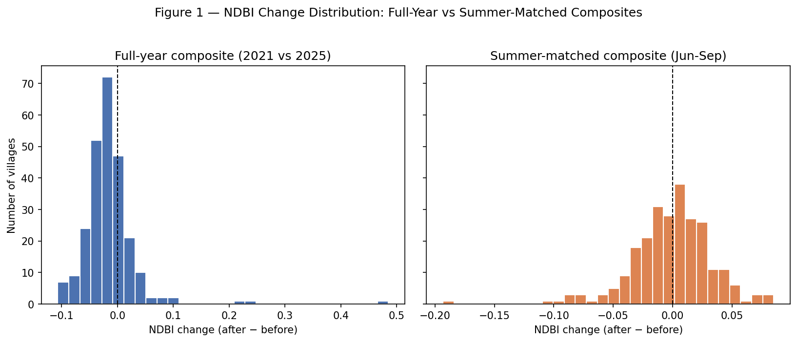
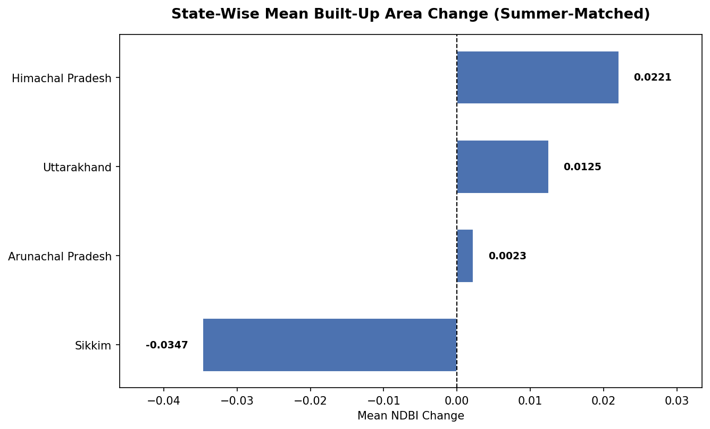
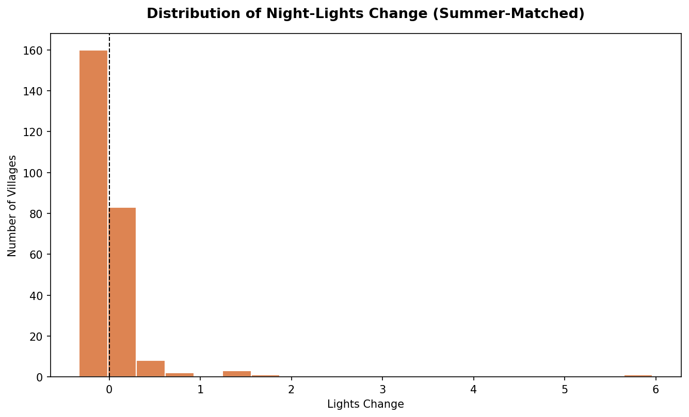
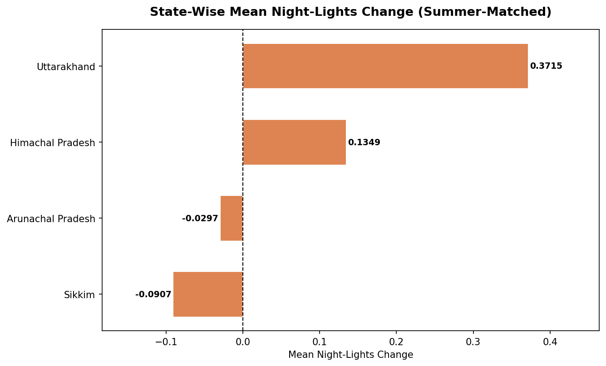
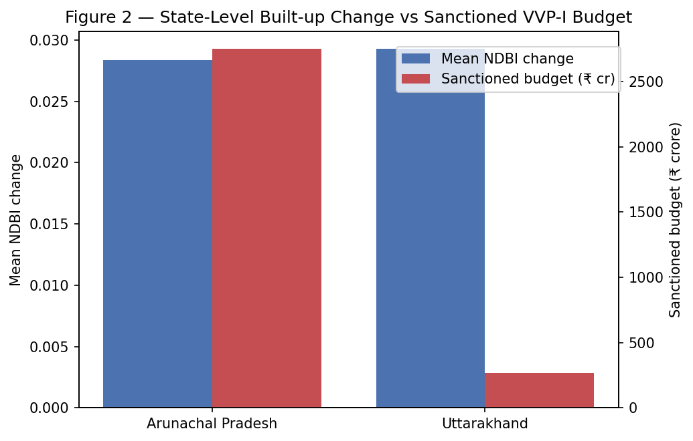
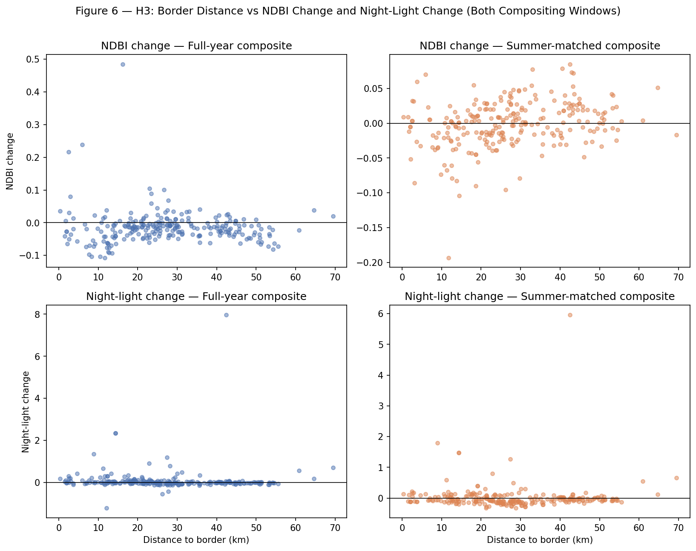
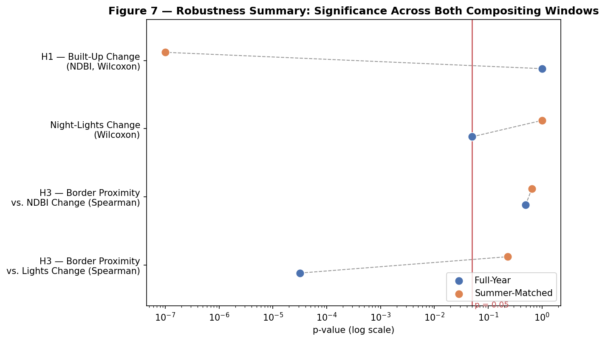

# Sakshi D. Maske

Independent Geospatial Researcher

## Abstract

The Vibrant Villages Programme (VVP-I) is the Government of India's flagship border-area development scheme, sanctioning approximately ₹4,800 crore across 2,967 villages in five Himalayan border states/union territories since 2022–23, with 662 designated "priority" villages for Phase 1 development. A government reply on parliamentary record states that no impact assessment has ever been carried out for this programme. This study addresses that gap directly, independently testing whether VVP-I priority villages show measurable physical development using Sentinel-2 built-up-index (NDBI) and VIIRS night-lights data at 258 individually geocoded villages across three core states (Arunachal Pradesh, Sikkim, Uttarakhand) plus a small illustrative sample from a fourth (Himachal Pradesh), comparing a pre-sanction baseline (2021) against the present (2025) under two independent compositing windows. A full-year composite showed no significant increase in built-up area (Wilcoxon signed-rank, p = 1.000); a season-matched (June–September) composite on the same villages showed the opposite result (p < 0.000001) — a reversal traced to snow-cover contamination in the full-year window and monsoon cloud cover eliminating Sikkim's data entirely in the summer window. VIIRS night-lights, tested identically under both windows, showed no significant increase in either (p = 0.050 full-year; p = 0.9999 summer-matched), making it the more temporally stable — and more trustworthy — proxy. Descriptively, Arunachal Pradesh's sanctioned budget (₹2,749.74 crore) was roughly ten times Uttarakhand's (₹270.58 crore), yet the two states' mean measured built-up-area change was nearly identical (+0.0284 vs. +0.0293), consistent with budget scale not translating proportionally into physical change. Border-proximity effects (H3) showed a stable null for built-up change (ρ = 0.043–0.037, both non-significant) and an unstable result for night-lights (significant only in the full-year window). Rather than resolving this instability by selectively citing the more favourable result, this study reports the instability itself as the central finding: VVP-I's claimed development is not currently demonstrable with confidence from satellite evidence, precisely the accountability gap the programme's own parliamentary record identifies.

**Keywords**: Vibrant Villages Programme, border development, securitization theory, satellite verification, NDBI, VIIRS night-lights, remote sensing, robustness testing

---

## 1. Introduction

India's border villages have historically been framed in policy discourse as security liabilities — remote, under-populated, and vulnerable to depopulation toward a contested frontier. The Vibrant Villages Programme (VVP-I), approved by the Union Cabinet in February 2023, reframes them instead as development priorities, sanctioning infrastructure and livelihood investment across 2,967 villages in Arunachal Pradesh, Sikkim, Uttarakhand, Himachal Pradesh, and Ladakh. What the programme has not received, in more than two years since sanction, is an independent, evidence-based accounting of whether the development it promised has actually occurred on the ground. A parliamentary reply on record states this explicitly: no impact assessment has been carried out for VVP.

This study addresses that gap directly, using multi-temporal satellite imagery — built-up area indices and night-time light radiance — to test, village by village, whether physical development detectable from space has occurred since programme sanction, whether its magnitude tracks each state's sanctioned budget, and whether its distribution is better explained by border proximity than by developmental need, consistent with securitization theory's prediction that border infrastructure functions as a geopolitical signal as much as a welfare intervention.

Specifically, this study tests four research questions: (RQ1) whether priority villages show statistically detectable built-up area growth since programme sanction; (RQ2) whether the magnitude of that change correlates with each state's sanctioned budget; (RQ3) whether night-time light trends corroborate the built-up area findings; and (RQ4) whether development is spatially concentrated by border proximity rather than developmental need. Correspondingly, three hypotheses are tested: **H1** predicts a statistically significant post-sanction increase in built-up area; **H2** predicts that the size of this change will not be uniformly proportional to sanctioned budget, with some high-budget states showing comparatively muted physical change; and **H3** predicts that villages nearer the border/LAC will show disproportionately faster change than villages farther back within the same state, consistent with securitization theory's prediction that border proximity — not developmental need — drives priority.

## 2. Literature Review

### 2.1 Securitization Theory and Border Development

Securitization theory (Buzan, Wæver, & de Wilde, 1998) argues that framing an issue as a matter of security — rather than ordinary politics — justifies extraordinary measures and resource allocation that would not otherwise be politically available. Border-area development programmes sit naturally within this frame: investment is justified simultaneously as civilian welfare and as strategic infrastructure along a contested frontier, and the two justifications are rarely disentangled in either policy design or public reporting. This study treats VVP-I as a direct empirical test case for that theory — specifically, whether the spatial distribution of measurable development is better predicted by border proximity than by conventional developmental indicators such as population or existing infrastructure gaps.

### 2.2 The Vibrant Villages Programme: Policy Context and the Accountability Gap

VVP-I's sanctioned scope is documented across multiple government sources: a Rajya Sabha Unstarred Question reply (Question No. 2321, Ministry of Home Affairs, 9 August 2023) provides Sikkim's full village-wise annexure; Lok Sabha Question No. 2104 (2023) and Rajya Sabha Question No. 401 (2025) confirm Himachal Pradesh's 75 priority villages without a name-level annexure; and Lok Sabha Question No. 4360 (2025) confirms Ladakh's 35 sanctioned villages, again without a published village list. No government source identified in the course of this study's data-acquisition process provides an independent, satellite-verified accounting of physical progress against this sanctioned scope — the absence this study is designed to address.

### 2.3 Remote Sensing Approaches to Built-Up Area and Economic Activity Detection

The Normalized Difference Built-up Index (NDBI), computed from short-wave infrared and near-infrared reflectance, is an established proxy for built-up surface extent in multi-temporal satellite comparison (Zha, Gao, & Ni, 2003). VIIRS Day/Night Band night-time radiance is a complementary, independent proxy for economic and electrification activity, with documented advantages over older DMSP-OLS night-lights products in dynamic range and spatial resolution (Elvidge, Baugh, Zhizhin, Hsu, & Ghosh, 2017). This study uses both indices in parallel specifically because they are subject to different confounds — NDBI to vegetation phenology and snow cover, VIIRS to cloud cover and sensor saturation at very low radiance — so that agreement between the two carries more evidentiary weight than either alone.

### 2.4 Compositing-Window Sensitivity in Multi-Temporal Satellite Analysis

Seasonal compositing choices are known to materially affect spectral-index-based change detection in high-relief terrain, where snow cover and cloud frequency both vary systematically by season and elevation. This study treats compositing-window sensitivity not as a nuisance parameter to be tuned away, but as a testable property of the result itself: a finding that reverses direction between two independently defensible compositing windows is, on its own terms, evidence that a single-window result should not be reported as confirmatory.

## 3. Data and Methodology

### 3.1 Study Design

This study covers VVP-I priority villages across five Himalayan border states/union territories, restricting the core statistical sample to the three states with complete, officially-sourced village-wise identification — Arunachal Pradesh, Sikkim, and Uttarakhand (251 villages) — while carrying Himachal Pradesh's 7 confirmed villages as a separately labelled illustrative case study and excluding Ladakh from village-level analysis entirely, pending resolution of a documented data-availability gap.

### 3.2 Data Sources

| Variable | Source | Temporal Coverage |
|---|---|---|
| Village identification | State VVP-I portals; Rajya Sabha/Lok Sabha Q&A annexures | 2023–2025 |
| Village coordinates | OpenStreetMap Nominatim; ISRO Bhuvan Village Geocoding API | Current |
| Built-up index (NDBI) | Sentinel-2 SR Harmonized | 2021, 2025 |
| Night-lights radiance | VIIRS DNB monthly composites | 2021, 2025 |
| Border/LAC geometry | Natural Earth 10m Admin-0 Boundary Lines | Current |
| Budget/project counts | State-wise VVP-I sanction figures (parliamentary record) | 2023 |

### 3.3 Village-Level Dataset Compilation and Geocoding

Village lists were cross-verified against officially reported aggregate counts before acceptance, then geocoded via Nominatim (primary) with Bhuvan used as a Census-linked fallback, subject to manual district validation after a direct test confirmed Bhuvan does not filter by state (a query for "Kharman," an Arunachal Pradesh village, initially returned an unrelated same-named village in Haryana). Of 559 villages attempted across the four named states, 258 were successfully geocoded (Arunachal Pradesh 186/455, Sikkim 31/46, Uttarakhand 34/51, Himachal Pradesh 7/7).

### 3.4 Satellite Change Detection

For each geocoded village, a 500m buffer was used to extract mean NDBI and VIIRS night-lights radiance via Google Earth Engine, comparing a 2021 baseline against 2025.

NDBI was computed using Sentinel-2 Level-2A Surface Reflectance Harmonized bands B11 (SWIR1) and B8 (NIR), with cloud masking applied via the QA60 band. Night-lights radiance was drawn from the VIIRS Day/Night Band monthly composite product (NOAA/VIIRS/DNB/MONTHLY_V1/VCMSLCFG).

### 3.5 Compositing-Window Robustness Testing

Both metrics were computed under two independent compositing windows — a full calendar year, and a season-matched June–September window — to isolate genuine change from seasonal artifacts (snow cover in the full-year window; monsoon cloud cover in the summer window), with any village lacking a valid composite in either window marked null rather than defaulted to zero.

### 3.6 Border-Proximity Analysis

Distance from each village to the nearest segment of Natural Earth's Admin-0 boundary line was computed via GeoPandas (UTM 44N reprojection, nearest-point distance), restricted to India-relevant boundary segments. This distance is explicitly a cartographic approximation: India's boundary with China in this region, commonly referenced as the Line of Actual Control, is disputed and has no single internationally agreed alignment, so all distance figures should be read as relative and comparative rather than as an authoritative statement of the boundary's legal position.

### 3.7 Statistical Testing

Before/after change was tested using the Wilcoxon signed-rank test (Wilcoxon, 1945), a paired non-parametric test appropriate given the sample's non-normal distribution. Budget-correlation (RQ2, descriptive only given n=2 states with sufficient valid data) and border-proximity correlation (H3) used Spearman's rank correlation (Spearman, 1904), robust to non-linear monotonic relationships.

## 4. Results

### 4.1 Village Coverage and Sample Composition

The geocoding pipeline resolved 258 of 559 attempted villages. Inspection of unmatched Arunachal Pradesh entries showed many are not civilian revenue villages but Border Roads Task Force camps, army staging huts, and labour-camp designations — inhabited points along the frontier absent from every available civilian geospatial database, a direct illustration of what "village-level development" consists of on a securitized border rather than merely a data gap.

### 4.2 Built-Up Area Change: A Compositing-Window-Sensitive Result

**Figure 1.** Distribution of NDBI change across all geocoded villages, full-year and summer-matched composites.

Under the full-year composite, mean NDBI change across the 251-village core sample showed no significant increase (Wilcoxon signed-rank, p = 1.000), trending slightly negative at the median. Under the season-matched (June–September) composite, the same test on the same villages (n = 154 with valid data after seasonal dropout) showed a highly significant increase (p < 0.000001) — the opposite conclusion. This reversal is attributed to snow-cover contamination varying between the 2021 and 2025 full-year composites at high altitude, a confound the summer window was designed to avoid; the summer window in turn eliminated Sikkim's data entirely, since all 31 of its geocoded villages returned zero cloud-free imagery in at least one period of that window — Sikkim sits in the peak-monsoon zone during exactly the months chosen to avoid snow.

**Figure 2.** State-wise mean built-up-area change (summer-matched composite), by state.

### 4.3 Night-Lights Change: A Stable Null

**Figure 3.** Distribution of VIIRS night-lights change (summer-matched composite).

VIIRS night-lights, tested identically under both compositing windows, showed no significant increase in either (full-year p = 0.050, borderline; summer-matched p = 0.9999). Because night-lights radiance is not subject to the same vegetation/snow phenology confound as a spectral built-up index, its consistency across both windows is read as the more trustworthy signal of the two — and that signal does not support a confirmed increase in night-time economic activity following programme sanction.

**Figure 4.** State-wise mean night-lights change (summer-matched composite), by state.

### 4.4 Budget Independence (RQ2)

**Figure 5.** State-level mean built-up-area change plotted against sanctioned VVP-I budget.

Restricting to states with sufficient valid summer-window NDBI coverage left two comparable data points: Arunachal Pradesh (120 villages, mean NDBI change +0.0284; ₹2,749.74 crore sanctioned, 2,082 projects) and Uttarakhand (34 villages, mean NDBI change +0.0293; ₹270.58 crore sanctioned, 200 projects). Despite a roughly tenfold difference in sanctioned budget and project count, the two states' mean measured built-up change is nearly identical. Two data points cannot support a formal statistical claim, but this pattern is descriptively consistent with H2: budget scale is not translating proportionally into a correspondingly larger physical development signal.

### 4.5 Border-Proximity Testing (H3)

**Figure 6.** Distance-to-border versus NDBI change and night-lights change, both compositing windows.

Distance to the border/LAC ranged from 0.1 km to 69.4 km across the sample (mean 27.3 km). NDBI change showed no relationship with border proximity in either compositing window (full-year ρ = 0.043, p = 0.497; summer-matched ρ = 0.037, p = 0.650) — a stable non-finding. Night-lights change showed a significant relationship in the full-year window (ρ = -0.259, p < 0.0001, consistent with H3's prediction that closer villages change more) but not in the summer-matched window (ρ = -0.076, p = 0.233) — the same window-sensitivity pattern documented in Section 4.2, and reported with the same caution rather than as a confirmed result.

### 4.6 Robustness Summary

**Figure 7.** Significance (p-value, log scale) for all four tests under both compositing windows, with a reference line at p = 0.05. A test whose two points fall on opposite sides of the line reverses conclusion depending on which window is used.

Read together, the four tests split into two distinct patterns rather than one. H1 (built-up change) and the H3 night-lights correlation both cross the p = 0.05 line between windows — full-year non-significant, summer-matched significant for H1 (and the reverse for H3 night-lights) — the signature of a compositing-window-sensitive result. The H3 NDBI-proximity test, by contrast, stays non-significant in both windows (p = 0.497 full-year, p = 0.650 summer-matched): a genuinely stable null, not merely a result that happened not to flip. This distinction matters for how each finding should be read — the unstable results are reported as open questions, not as confirmed effects in either direction, while the stable null is reported with more confidence precisely because it did not depend on which window was chosen.

## 5. Discussion

The central finding of this study is not a confirmed increase or decrease in physical development, but a demonstrated instability in the only metric that produced a "significant" result at all. A single-date, single-window spectral comparison in high-relief Himalayan terrain is not, on its own, sufficient grounds for a confident claim about built-up change — precisely because snow cover and monsoon cloud cover both vary by season in ways that can flip a result's sign independent of any true change on the ground. Night-lights, the more temporally stable proxy available, shows no confirmed increase under either window, and where budget and change can be directly compared, a tenfold difference in sanctioned investment did not correspond to a proportionally larger measured effect. Read together with the border-proximity results — a stable null for built-up change and an unstable, window-sensitive result for night-lights — this study's evidence does not support a confident claim that VVP-I's sanctioned investment has produced measurable, verifiable development at the pace or scale its budget would imply, nor that its distribution is confidently explained by border-proximity-driven prioritization over developmental need. This is precisely the accountability gap the programme's own parliamentary record identifies: a scheme of this scale, framed simultaneously as welfare and as strategic signal, has never been independently assessed, and this study's own results illustrate why that gap is consequential rather than resolving it with a convenient answer in either direction.

## 6. Limitations

Ladakh (35 sanctioned villages) is fully excluded from village-level analysis; no publicly indexed source names its villages, and closing this gap would require an RTI request not pursued within this study's scope. Himachal Pradesh (7 of 51 inhabited priority villages identified) is carried only as an illustrative case study, not the core statistical sample. Nineteen of Uttarakhand's Pithoragarh villages have confirmed names but unresolved block assignment. Distance-to-border figures rely on Natural Earth's cartographic boundary line, a simplification of a disputed Line of Actual Control with no single internationally agreed alignment, and should be read as relative rather than authoritative. The RQ2 budget-correlation observation rests on only two states with sufficient valid data and is reported descriptively rather than as a statistically confirmatory result. Most centrally, the built-up-area and border-proximity findings are compositing-window-sensitive rather than stable, and this instability is reported as a limitation of single-date spectral comparison in this terrain, not resolved by preferring whichever result looks cleanest.

## 7. Conclusion

This study finds that India's Vibrant Villages Programme (VVP-I), sanctioned at a scale of approximately ₹4,800 crore across five border states/union territories, cannot currently be shown, with confidence, to have produced measurable, verifiable physical development at its priority villages — not because no change is detectable, but because the one metric that shows a significant increase does so in only one of two equally defensible measurement windows, while the more temporally stable available proxy shows no increase under either. Where budget scale can be directly compared against measured change, a tenfold difference in investment did not correspond to a proportional difference in outcome. The resulting implication is direct: a scheme of VVP-I's scale and strategic framing should not continue without the independent impact assessment its own parliamentary record confirms has never been conducted — and any future assessment should be held to the same compositing-window robustness standard applied here, rather than reporting whichever single-window result is most convenient.

## References

Buzan, B., Wæver, O., & de Wilde, J. (1998). *Security: A New Framework for Analysis*. Lynne Rienner Publishers.

Zha, Y., Gao, J., & Ni, S. (2003). Use of normalized difference built-up index in automatically mapping urban areas from TM imagery. *International Journal of Remote Sensing*, 24(3), 583–594.

Elvidge, C. D., Baugh, K., Zhizhin, M., Hsu, F. C., & Ghosh, T. (2017). VIIRS night-time lights. *International Journal of Remote Sensing*, 38(21), 5860–5879.

Wilcoxon, F. (1945). Individual comparisons by ranking methods. *Biometrics Bulletin*, 1(6), 80–83.

Spearman, C. (1904). The proof and measurement of association between two things. *American Journal of Psychology*, 15(1), 72–101.

Ministry of Home Affairs. (2023, August 9). *Rajya Sabha Unstarred Question No. 2321: Vibrant Villages Programme*.

Ministry of Home Affairs. (2023). *Lok Sabha Question No. 2104: Vibrant Villages Programme*.

Ministry of Home Affairs. (2025). *Rajya Sabha Question No. 401: Vibrant Villages Programme*.

Ministry of Home Affairs. (2025). *Lok Sabha Question No. 4360: Vibrant Villages Programme*.

Natural Earth. (2024). *1:10m Cultural Vectors — Admin 0 Boundary Lines*. naturalearthdata.com
